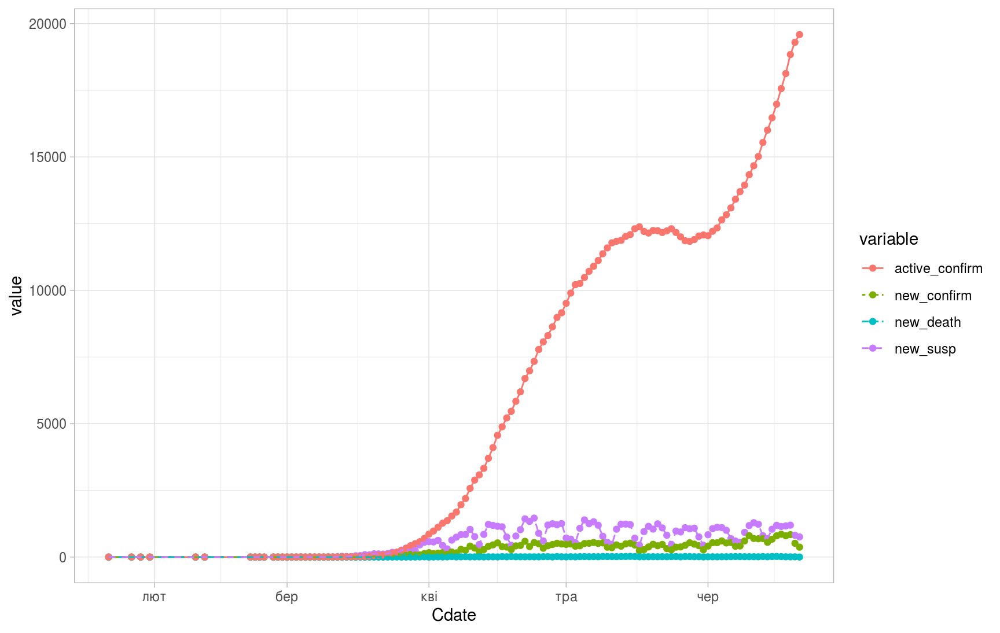
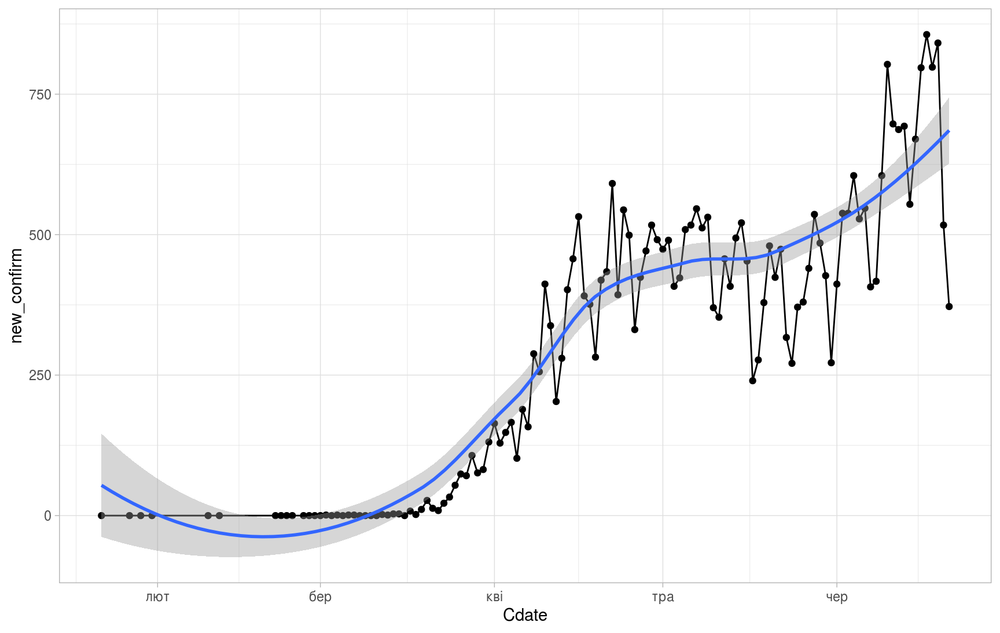
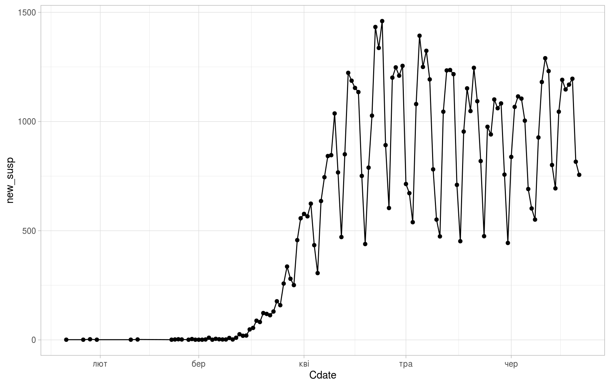
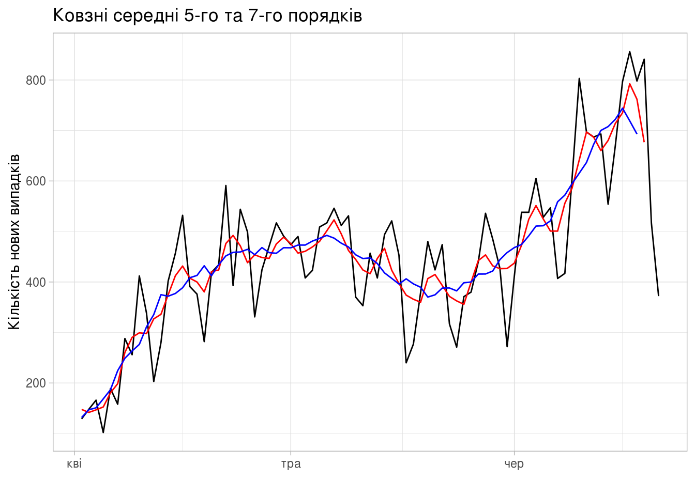
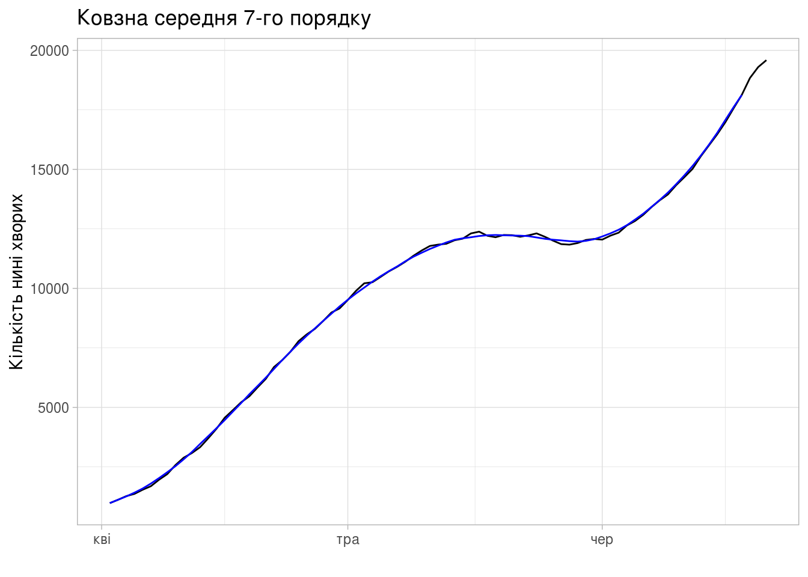
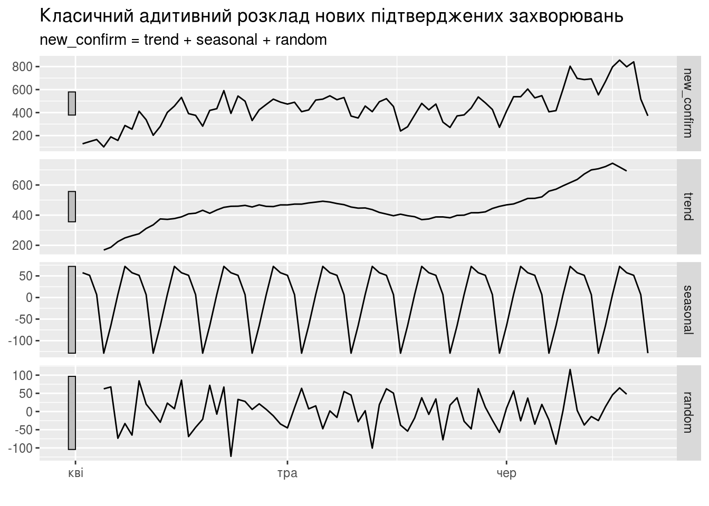
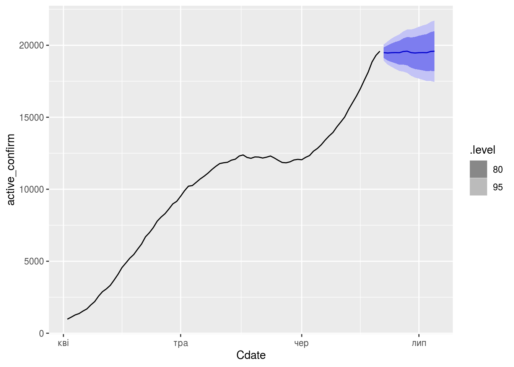

Розклад часових рядів
================

Мета: отримати тренди, сезонні коливання, випадкові відхилення різними методами.

Дані: - Сумарна кількість: - підтверджених випадків для України, - летальних випадків для України, - одужання для України, - Добова кількість підтверджених випадків для: - України - Київ

<https://otexts.com/fpp3/decomposition.html>

Огляд
=====

-   Сумарна кількість:

-   підтверджених випадків для України,

-   летальних випадків для України,

-   одужання для України,

Інший метод побудови, лінії різного кольору.

``` r
library(fpp3)
library(fable)
library(tsibble)
library(feasts)
library(tidyverse)
```

``` r
## area_dyn <- read_csv('../covid19_by_area_type_hosp_dynamics.csv')
area_dyn <- read_csv('https://raw.github.com/VasiaPiven/covid19_ua/master/covid19_by_area_type_hosp_dynamics.csv')

daily_area_dyn <- area_dyn %>%
    select(zvit_date, new_susp, new_confirm, new_death, active_confirm) %>%
    group_by(zvit_date) %>%
    summarise(new_susp = sum(new_susp),
              new_confirm = sum(new_confirm),
              new_death = sum(new_death),
              active_confirm = sum(active_confirm)) %>%
    mutate(susp_confirm_ratio = new_confirm / new_susp)

daily_area_dyn <- daily_area_dyn %>%
    mutate(Cdate = as.Date(strptime(zvit_date, "%Y-%m-%d")))

## зібрати дані з декількох стовпчиків у новий стовпчик з назвою
## "value" (пара ключ-значення), а стара назва стовпчика буде
## збережена у стовпчику "variable"
daily_area_gath <- daily_area_dyn %>%
    select(Cdate, new_susp, new_confirm, new_death, active_confirm) %>%
    pivot_longer(-Cdate, names_to = "variable", values_to = "value")
```

``` r
(ggplot(daily_area_gath, aes(x=Cdate,y=value))
    + geom_point(aes(color = variable))
    + geom_line(aes(color = variable, linetype = variable))
    + theme_light())
```



``` r
(ggplot(daily_area_dyn, aes(x=Cdate,y=new_confirm))
    + geom_point()
    + geom_line()
    + geom_smooth()
    + theme_light())
```

    ## `geom_smooth()` using method = 'loess' and formula 'y ~ x'



``` r
(ggplot(daily_area_dyn, aes(x=Cdate,y=new_susp))
    + geom_point()
    + geom_line()
    + theme_light())
```



``` r
(ggplot(daily_area_dyn, aes(x=Cdate,y=new_death))
    + geom_point()
    + geom_line()
    + theme_light())
```


Співвідношення кількості підтверджених випадків до кількості підозр.

``` r
(ggplot(daily_area_dyn, aes(zvit_date, new_confirm/new_susp))
    + geom_line()
    + geom_smooth(se = FALSE)
    + theme_light())
```

    ## `geom_smooth()` using method = 'loess' and formula 'y ~ x'


Ковзне середнє
==============

Побудуємо [ковзне середнє](https://otexts.com/fpp3/moving-averages.html) 5-го та 7-го порядків:

``` r
daily_area_dyn_ma <- daily_area_dyn %>%
    mutate(new_confirm_5ma = slide_dbl(new_confirm, mean, .size = 5, .align = "center"),
           new_confirm_7ma = slide_dbl(new_confirm, mean, .size = 7, .align = "center"),
           active_confirm_7ma = slide_dbl(active_confirm, mean, .size = 7,
                                          .align = "center"),
           new_death_7ma = slide_dbl(new_death, mean, .size = 7, .align = "center")) %>%
    as_tsibble(index=Cdate) %>%
    filter(Cdate > as.Date('2020-04-01'))
```

Нових підтверджених захворювань

``` r
daily_area_dyn_ma %>%
    autoplot(new_confirm) +
    autolayer(daily_area_dyn_ma, new_confirm_5ma, color='red') +
    autolayer(daily_area_dyn_ma, new_confirm_7ma, color='blue') +
    xlab("") + ylab("Кількість нових випадків") +
    ggtitle("Ковзні середні 5-го та 7-го порядків") +
    guides(colour=guide_legend(title="series")) +
    theme_light()
```

    ## Warning: Removed 2 row(s) containing missing values (geom_path).

    ## Warning: Removed 3 row(s) containing missing values (geom_path).



Нині хворих

``` r
daily_area_dyn_ma %>%
    autoplot(active_confirm) +
    autolayer(daily_area_dyn_ma, active_confirm_7ma, color='blue') +
    xlab("") + ylab("Кількість нині хворих") +
    ggtitle("Ковзна середня 7-го порядку") +
    guides(colour=guide_legend(title="series")) +
    theme_light()
```

    ## Warning: Removed 3 row(s) containing missing values (geom_path).



Кількість летальних випадків

``` r
daily_area_dyn_ma %>%
    autoplot(new_death) +
    autolayer(daily_area_dyn_ma, new_death_7ma, color='blue') +
    xlab("") + ylab("Кількість летальних випадків") +
    ggtitle("Ковзна середня 7-го порядку") +
    guides(colour=guide_legend(title="series")) +
    theme_light()
```

    ## Warning: Removed 3 row(s) containing missing values (geom_path).


Декомпозиція
============

Класичний розклад
-----------------

[Класичний розклад](https://otexts.com/fpp3/classical-decomposition.html) часового ряду на складові:

-   тренд
-   сезонні відхилення
-   випадкові коливання (шум)

``` r
daily_area_dyn_ma %>%
  model(classical_decomposition(new_confirm, type = "additive")) %>%
  components() %>%
  autoplot() + xlab("") +
  ggtitle("Класичний адитивний розклад нових підтверджених захворювань")
```



``` r
daily_area_dyn_ma %>%
  model(classical_decomposition(new_susp, type = "additive")) %>%
  components() %>%
  autoplot() + xlab("") +
  ggtitle("Класичний адитивний розклад нових підозр")
```


``` r
daily_area_dyn_ma %>%
  model(classical_decomposition(susp_confirm_ratio, type = "additive")) %>%
  components() %>%
  autoplot() + xlab("") +
  ggtitle("Класичний адитивний розклад нових підозр")
```


Методом X11
-----------

На жаль метод X11 придатний для оброблення часових рядів, періодичність яких місячна (параметр `period` дорівнює 12) або квартальна (параметр `period` дорівнює 4).

Оскільки часові ряди для захворюваності мають добовий крок, то параметр `period` для них становить 7.

    [1] The X11 method only supports monthly (`period = 12`) and quarterly (`period = 4`) seasonal patterns

SEATS
-----

<!-- ```{r} -->
<!-- seats_dcmp <- daily_area_dyn_ma %>% -->
<!--
model(seats = feasts:::SEATS(new_confirm)) %>% -->
<!-- components()
-->
<!-- autoplot(seats_dcmp) + xlab("Year") + -->
<!--   ggtitle("SEATS decomposition of total US retail employment") -->
<!-- ``` -->
STL
---

STL is a versatile and robust method for decomposing time series. STL is an acronym for “Seasonal and Trend decomposition using Loess”, while Loess is a method for estimating nonlinear relationships. The STL method was developed by Cleveland, Cleveland, McRae, & Terpenning (1990).

<https://otexts.com/fpp3/stl.html>

``` r
stl_dcmp <- daily_area_dyn_ma %>%
    model(STL(new_confirm ~ trend(window=7) + season(window='periodic'),
              robust = TRUE)) %>%
    components()

autoplot(stl_dcmp)
```


Розклад часового ряду для зареєстрованих підозр:

``` r
autoplot(daily_area_dyn_ma %>%
         model(STL(new_susp ~ trend(window=7) + season(window='periodic'),
                   robust = TRUE)) %>%
         components())
```


Прогнозування з декомпозицією
=============================

<https://otexts.com/fpp3/forecasting-decomposition.html>

Нових захворювань
-----------------

``` r
fit_dcmp_confirm <- daily_area_dyn_ma %>%
    model(stlf = decomposition_model(
              STL(new_confirm ~ trend(window = 7), robust = TRUE),
              NAIVE(season_adjust)))

fit_dcmp_confirm %>%
    forecast() %>%
    autoplot(daily_area_dyn_ma)
```


Активних
--------

``` r
fit_dcmp_active <- daily_area_dyn_ma %>%
    model(stlf = decomposition_model(
              STL(active_confirm ~ trend(window = 7), robust = TRUE),
              NAIVE(season_adjust)))

fit_dcmp_active %>%
    forecast() %>%
    autoplot(daily_area_dyn_ma)
```



Декомпозиція ggseas
===================

todo: <https://github.com/ellisp/ggseas>

``` r
library(ggseas)
```

[Повернутись на головну](index.html) або [повідомити про помилку](https://github.com/vityok/covid19_ua/issues)
