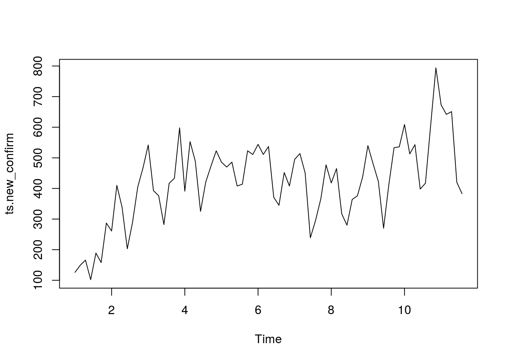
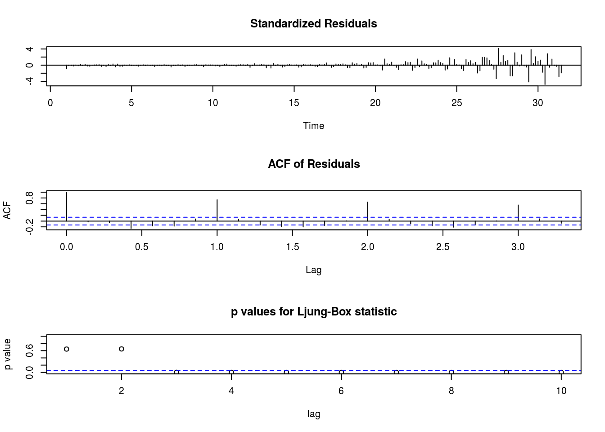

Побудова прогнозів стандартною функцією ARIMA
================

Це лише заготовка, сторінка роботі.

Завантаження бібліотек

``` r
library(tidyverse)
```

<https://www.rdocumentation.org/packages/stats/versions/3.6.2/topics/arima>

Створення об'єктів типу "часовий ряд" на основі фреймів даних. Частота 7 рекомендована для щоденних вимирів та тижневій "природній" періодичності.

``` r
area_dyn <- read_csv('../covid19_by_area_type_hosp_dynamics.csv')
```

    ## Parsed with column specification:
    ## cols(
    ##   zvit_date = col_date(format = ""),
    ##   registration_area = col_character(),
    ##   priority_hosp_area = col_character(),
    ##   edrpou_hosp = col_character(),
    ##   legal_entity_name_hosp = col_character(),
    ##   legal_entity_lat = col_double(),
    ##   legal_entity_lng = col_double(),
    ##   person_gender = col_character(),
    ##   person_age_group = col_character(),
    ##   add_conditions = col_character(),
    ##   is_medical_worker = col_character(),
    ##   new_susp = col_double(),
    ##   new_confirm = col_double(),
    ##   active_confirm = col_double(),
    ##   new_death = col_double(),
    ##   new_recover = col_double()
    ## )

    ## Warning: 82 parsing failures.
    ##  row              col               expected  actual                                        file
    ## 1381 legal_entity_lat no trailing characters ,604941 '../covid19_by_area_type_hosp_dynamics.csv'
    ## 1381 legal_entity_lng no trailing characters ,271351 '../covid19_by_area_type_hosp_dynamics.csv'
    ## 3272 legal_entity_lat no trailing characters ,604941 '../covid19_by_area_type_hosp_dynamics.csv'
    ## 3272 legal_entity_lng no trailing characters ,271351 '../covid19_by_area_type_hosp_dynamics.csv'
    ## 5227 legal_entity_lat no trailing characters ,604941 '../covid19_by_area_type_hosp_dynamics.csv'
    ## .... ................ ...................... ....... ...........................................
    ## See problems(...) for more details.

``` r
daily_area_dyn <- area_dyn %>%
    select(zvit_date, new_susp, new_confirm, new_death) %>%
    group_by(zvit_date) %>%
    summarise(new_susp = sum(new_susp),
              new_confirm = sum(new_confirm),
              new_death = sum(new_death)) %>%
    filter(zvit_date > as.Date("2020-04-01"))

ts.new_confirm <- ts(daily_area_dyn$new_confirm, frequency=7)
ts.new_susp    <- ts(daily_area_dyn$new_susp, frequency=7)

plot(ts.new_confirm)
```



*order*: A specification of the non-seasonal part of the ARIMA model: the three integer components \[(p,d,q)\] are the AR order, the degree of differencing, and the MA order.

``` r
fit.new_confirm <- arima(ts.new_confirm, order=c(3,0,0))
tsdiag(fit.new_confirm)
```



``` r
predict <- predict(fit.new_confirm, 7)

#plot(predict)
```

[Повернутись на головну](index.html) або [повідомити про помилку]((https://github.com/vityok/covid19_ua/issues))
