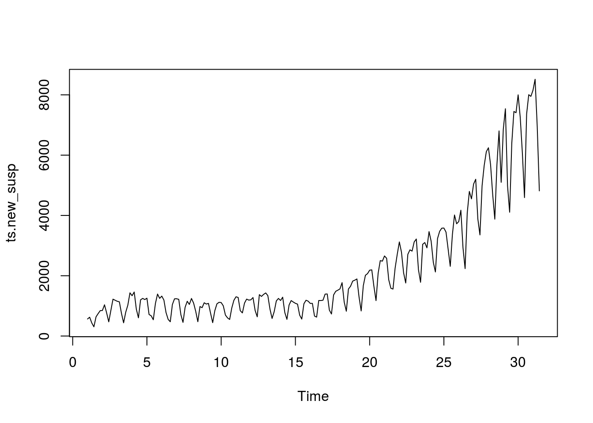

Побудова прогнозів стандартною функцією ARIMA
================

Це лише заготовка, сторінка роботі.

Завантаження бібліотек

``` r
library(tidyverse)
```

<https://www.rdocumentation.org/packages/stats/versions/3.6.2/topics/arima>

Створення об'єктів типу "часовий ряд" на основі фреймів даних. Частота 7 рекомендована для щоденних вимирів та тижневій "природній" періодичності.

``` r
area_dyn <- read_csv('../covid19_by_area_type_hosp_dynamics.csv')

daily_area_dyn <- area_dyn %>%
    select(zvit_date, new_susp, new_confirm, new_death) %>%
    group_by(zvit_date) %>%
    summarise(new_susp = sum(new_susp),
              new_confirm = sum(new_confirm),
              new_death = sum(new_death)) %>%
    filter(zvit_date > as.Date("2020-04-01"))

ts.new_confirm <- ts(daily_area_dyn$new_confirm, frequency=7)
ts.new_susp    <- ts(daily_area_dyn$new_susp, frequency=7)
```

``` r
plot(ts.new_confirm)
```


``` r
plot(ts.new_susp)
```



*order*: A specification of the non-seasonal part of the ARIMA model: the three integer components \[(p,d,q)\] are the AR order, the degree of differencing, and the MA order.

``` r
fit.new_confirm <- arima(ts.new_confirm, order=c(3,0,0))
tsdiag(fit.new_confirm)
```


``` r
predict_confirm <- predict(fit.new_confirm, 7)

predict_confirm
```

    ## $pred
    ## Time Series:
    ## Start = c(12, 5) 
    ## End = c(13, 4) 
    ## Frequency = 7 
    ## [1] 375.0655 385.7966 396.0244 404.1602 410.4938 415.4006 419.1990
    ## 
    ## $se
    ## Time Series:
    ## Start = c(12, 5) 
    ## End = c(13, 4) 
    ## Frequency = 7 
    ## [1]  97.72029 127.32147 142.83110 151.41799 156.34305 159.22088 160.92010

``` r
fit.new_susp <- arima(ts.new_susp, order=c(3,0,7))

tsdiag(fit.new_susp)
```


``` r
predict_susp <- predict(fit.new_susp, 7)

predict_susp
```

    ## $pred
    ## Time Series:
    ## Start = c(12, 5) 
    ## End = c(13, 4) 
    ## Frequency = 7 
    ## [1] 1055.9091 1121.8659 1052.7461 1135.7978 1206.6308  964.2802  810.3121
    ## 
    ## $se
    ## Time Series:
    ## Start = c(12, 5) 
    ## End = c(13, 4) 
    ## Frequency = 7 
    ## [1] 173.8386 198.4971 201.0111 202.1617 207.5799 208.8873 210.0631

[Повернутись на головну](index.html) або [повідомити про помилку](https://github.com/vityok/covid19_ua/issues)
