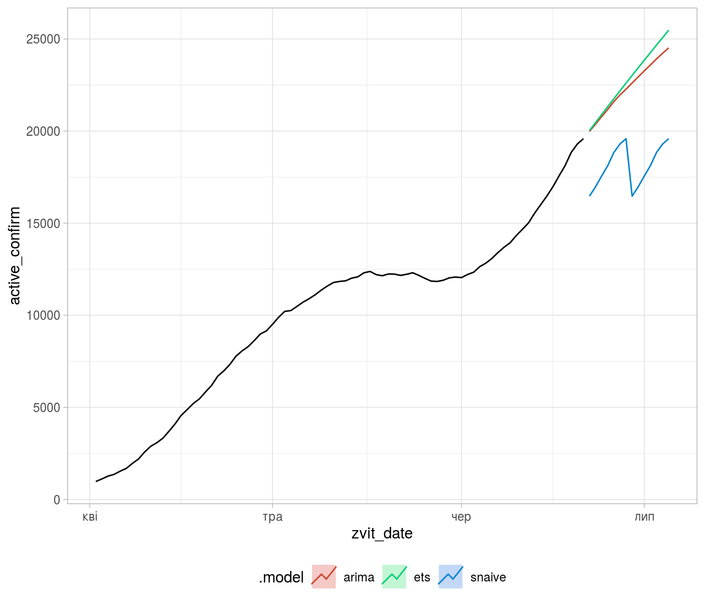
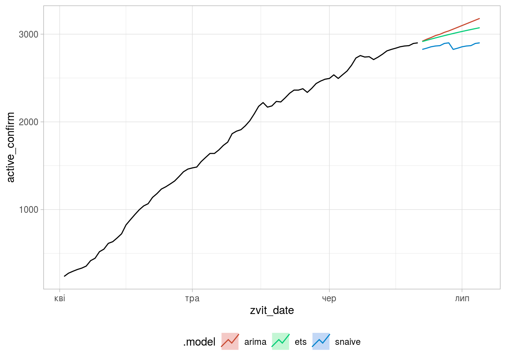
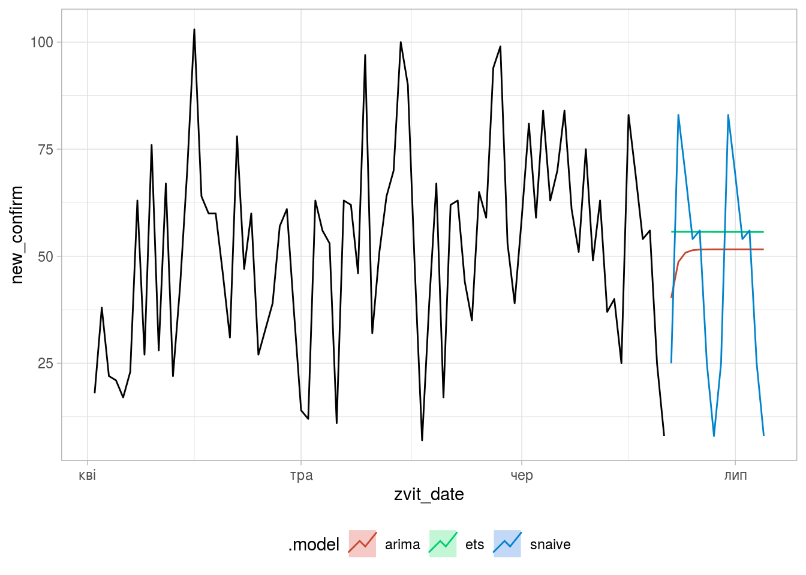

Побудова прогнозів із використанням Tidyverts Fable
================

Це лише заготовка, сторінка роботі.

Завантаження бібліотек

``` r
library(tidyverse)
library(fable)
library(tsibble)
library(feasts)
```

<https://fable.tidyverts.org/>

Добові зміни
============

``` r
area_dyn <- read_csv('../covid19_by_area_type_hosp_dynamics.csv')
```

    ## Parsed with column specification:
    ## cols(
    ##   zvit_date = col_date(format = ""),
    ##   registration_area = col_character(),
    ##   priority_hosp_area = col_character(),
    ##   edrpou_hosp = col_character(),
    ##   legal_entity_name_hosp = col_character(),
    ##   legal_entity_lat = col_number(),
    ##   legal_entity_lng = col_number(),
    ##   person_gender = col_character(),
    ##   person_age_group = col_character(),
    ##   add_conditions = col_character(),
    ##   is_medical_worker = col_character(),
    ##   new_susp = col_double(),
    ##   new_confirm = col_double(),
    ##   active_confirm = col_double(),
    ##   new_death = col_double(),
    ##   new_recover = col_double()
    ## )

``` r
daily_area_dyn <- area_dyn %>%
    select(zvit_date, new_susp, new_confirm, new_death) %>%
    group_by(zvit_date) %>%
    summarise(new_susp = sum(new_susp),
              new_confirm = sum(new_confirm),
              new_death = sum(new_death)) %>%
    filter(zvit_date > as.Date("2020-04-01"))

tle.dyn <- daily_area_dyn %>%
    as_tsibble(index=zvit_date)
```

Модель та графік

``` r
ap <- tle.dyn %>%
    model(
        ets = ETS(box_cox(new_confirm, 0.3)),
        arima = ARIMA(new_confirm),
        snaive = SNAIVE(new_confirm)) %>%
    forecast(h = "2 weeks") %>%
    autoplot(tle.dyn, level = NULL)

(ap
    + theme_light()
    + theme(legend.position = "bottom"))
```


Кількість активних випадків
===========================

``` r
active_st <- area_dyn %>%
    select(zvit_date, active_confirm) %>%
    group_by(zvit_date) %>%
    summarise(active_confirm = sum(active_confirm)) %>%
    filter(zvit_date > as.Date("2020-04-01"))

active.tble <- active_st %>%
    as_tsibble(index = zvit_date)
```

Модель та графік

``` r
ap.active <- active.tble %>%
    model(
        ets = ETS(box_cox(active_confirm, 0.3)),
        arima = ARIMA(active_confirm),
        snaive = SNAIVE(active_confirm)) %>%
    forecast(h = "2 weeks") %>%
    autoplot(active.tble, level = NULL)

(ap.active
    + theme_light()
    + theme(legend.position = "bottom"))
```



Активних та нових випадків у м. Київ
====================================

``` r
kyiv.dyn <- area_dyn %>%
    filter(priority_hosp_area == 'м. Київ') %>%
    select(zvit_date, active_confirm, new_confirm) %>%
    group_by(zvit_date) %>%
    summarise(active_confirm = sum(active_confirm),
              new_confirm = sum(new_confirm)) %>%
    filter(zvit_date > as.Date("2020-04-01"))

kyiv.ts <- kyiv.dyn %>%
    as_tsibble(index = zvit_date)
```

Стан та прогноз підтверджених активних випадків у м. Київ:

``` r
kyiv.active <- kyiv.ts %>%
    model(
        ets = ETS(box_cox(active_confirm, 0.3)),
        arima = ARIMA(active_confirm),
        snaive = SNAIVE(active_confirm)) %>%
    forecast(h = "2 weeks") %>%
    autoplot(kyiv.ts, level = NULL)

(kyiv.active
    + theme_light()
    + theme(legend.position = "bottom"))
```



``` r
kyiv.new <- kyiv.ts %>%
    model(
        ets = ETS(box_cox(new_confirm, 0.3)),
        arima = ARIMA(new_confirm),
        snaive = SNAIVE(new_confirm)) %>%
    forecast(h = "2 weeks") %>%
    autoplot(kyiv.ts, level = NULL)

(kyiv.new
    + theme_light()
    + theme(legend.position = "bottom"))
```



[Повернутись на головну](index.html) або [повідомити про помилку]((https://github.com/vityok/covid19_ua/issues))
