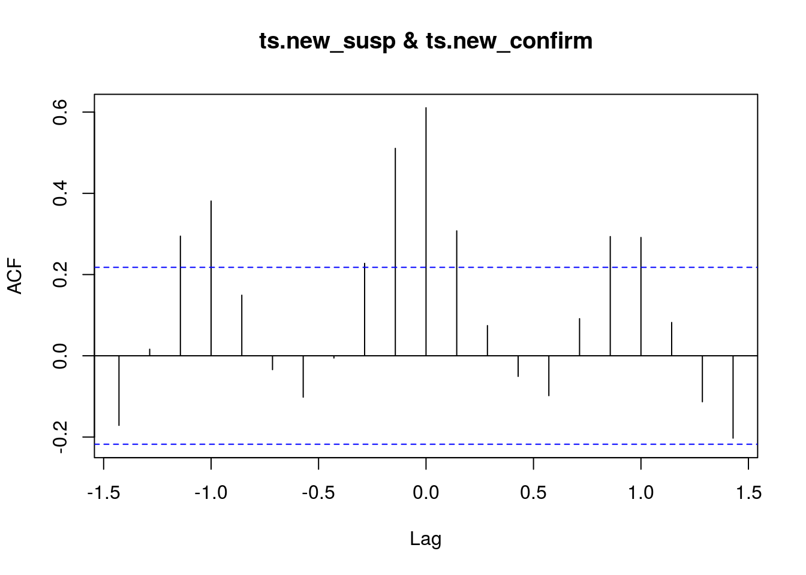
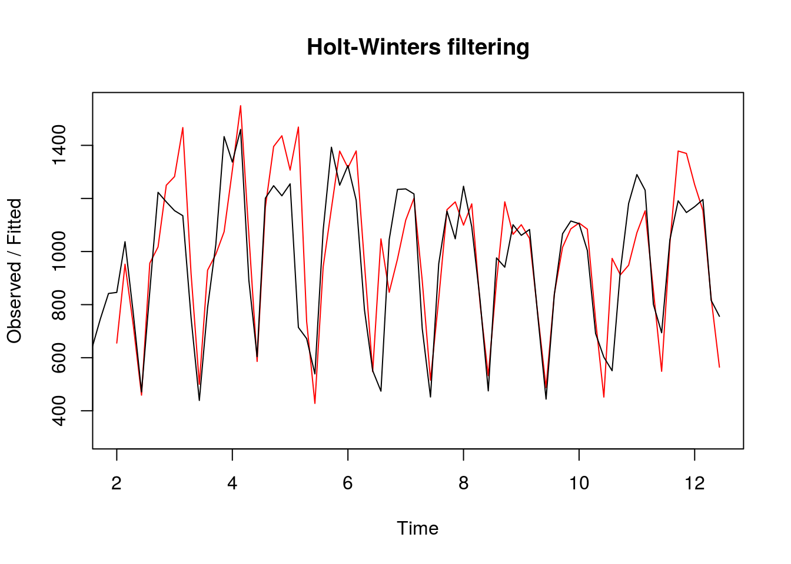

Побудова прогнозів із використанням Tidyverts Fable
================

Це лише заготовка, сторінка роботі.

<https://otexts.com/fpp2/holt-winters.html>

Завантаження бібліотек

``` r
library(tidyverse)
library(fable)
library(tsibble)
```

Створення об'єктів типу "часовий ряд" на основі фреймів даних. Частота 7 рекомендована для щоденних вимирів та тижневій "природній" періодичності.

``` r
ts.new_confirm <- ts(daily_area_dyn$new_confirm, frequency=7)
ts.new_susp    <- ts(daily_area_dyn$new_susp, frequency=7)
```

Корелограма нових підозр (просто перегляд)

``` r
acf(ts.new_susp)
```


``` r
ccf(ts.new_susp, ts.new_confirm, lag.max = 10)
```



Побудова моделі Холта-Вінтерса

``` r
hw.new_susp <- HoltWinters(ts.new_susp, seasonal="multiplicative") # additive

plot(hw.new_susp)
```



Прогноз із використанням моделі Холта-Вінтерса на 14 "періодів" спостережень. В даному випадку, це 14 днів або 2 тижні

``` r
fc.new_susp <- predict(hw.new_susp, 14)
```

``` r
plot(hw.new_susp, fc.new_susp)
```


[Повернутись на головну](index.html) або [повідомити про помилку]((https://github.com/vityok/covid19_ua/issues))
