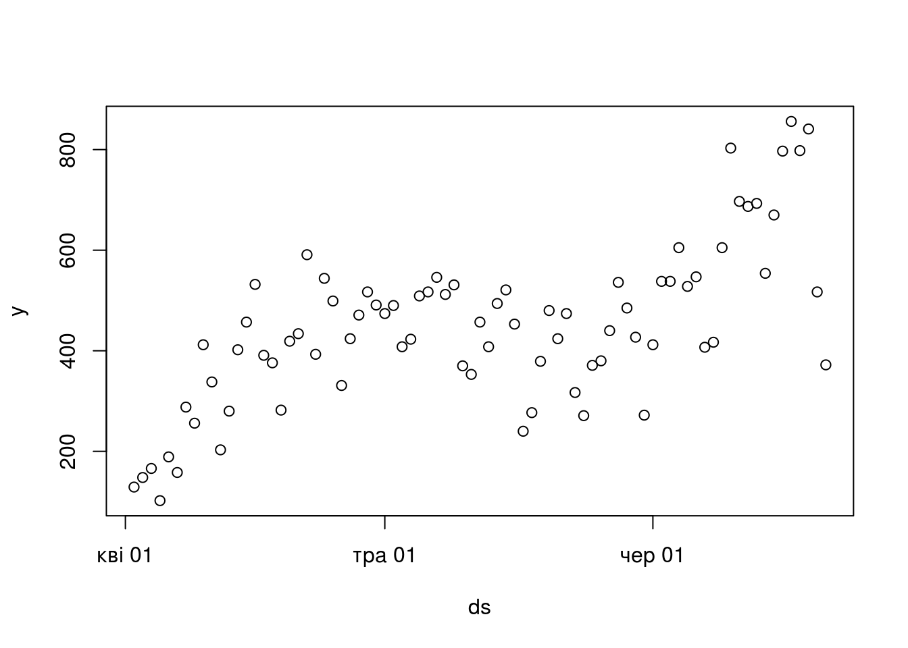
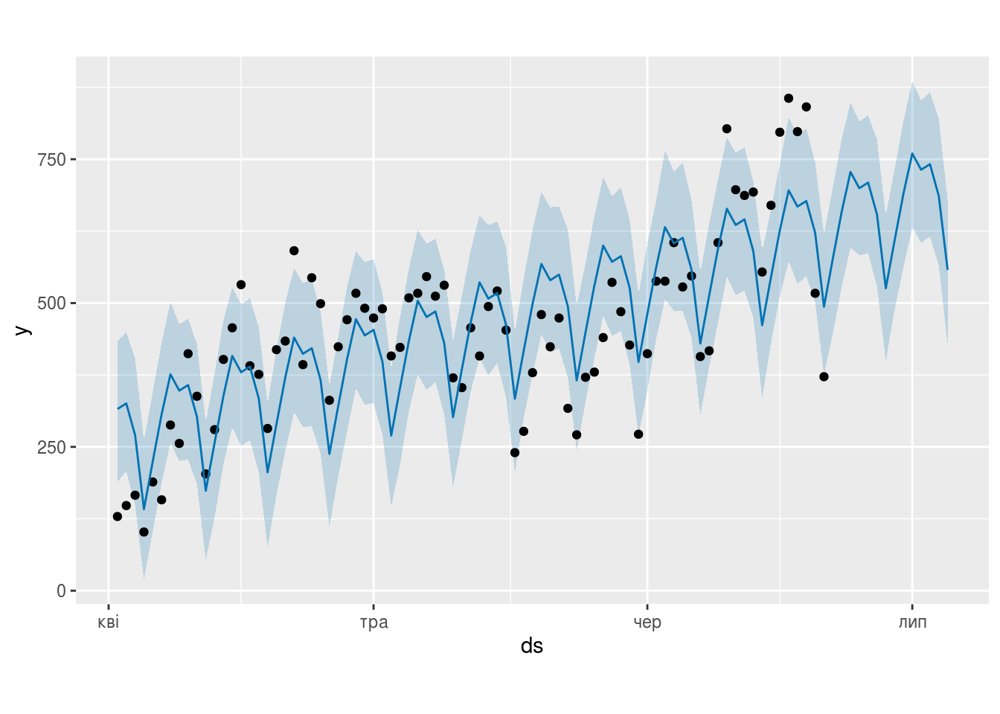

Побудова прогнозів із використанням Facebook Prophet
================

Це лише заготовка, сторінка роботі.

``` r
library(tidyverse)
library(prophet)
```

    ## Loading required package: Rcpp

    ## Loading required package: rlang

    ## 
    ## Attaching package: 'rlang'

    ## The following objects are masked from 'package:purrr':
    ## 
    ##     %@%, as_function, flatten, flatten_chr, flatten_dbl, flatten_int,
    ##     flatten_lgl, flatten_raw, invoke, list_along, modify, prepend,
    ##     splice

Prophet
=======

<https://facebook.github.io/prophet/docs/quick_start.html#r-api>

First we read in the data and create the outcome variable. As in the Python API, this is a dataframe with columns ds and y, containing the date and numeric value respectively. The ds column should be YYYY-MM-DD for a date, or YYYY-MM-DD HH:MM:SS for a timestamp. As above, we use here the log number of views to Peyton Manning’s Wikipedia page, available here.

``` r
df <- read_csv('../covid19_by_area_type_hosp_dynamics.csv')
```

    ## Parsed with column specification:
    ## cols(
    ##   zvit_date = col_date(format = ""),
    ##   registration_area = col_character(),
    ##   priority_hosp_area = col_character(),
    ##   edrpou_hosp = col_character(),
    ##   legal_entity_name_hosp = col_character(),
    ##   legal_entity_lat = col_number(),
    ##   legal_entity_lng = col_number(),
    ##   person_gender = col_character(),
    ##   person_age_group = col_character(),
    ##   add_conditions = col_character(),
    ##   is_medical_worker = col_character(),
    ##   new_susp = col_double(),
    ##   new_confirm = col_double(),
    ##   active_confirm = col_double(),
    ##   new_death = col_double(),
    ##   new_recover = col_double()
    ## )

``` r
df <- df %>%
    select(zvit_date, new_confirm) %>%
    group_by(zvit_date) %>%
    summarise(new_confirm = sum(new_confirm)) %>%
    filter(zvit_date > as.Date("2020-04-01"))

df <- df %>% rename(ds = zvit_date, y = new_confirm)

head(df)
```

    ## # A tibble: 6 x 2
    ##   ds             y
    ##   <date>     <dbl>
    ## 1 2020-04-02   129
    ## 2 2020-04-03   148
    ## 3 2020-04-04   166
    ## 4 2020-04-05   102
    ## 5 2020-04-06   189
    ## 6 2020-04-07   158

``` r
plot(df)
```



We call the prophet function to fit the model. The first argument is the historical dataframe. Additional arguments control how Prophet fits the data and are described in later pages of this documentation.

``` r
m <- prophet(df)
```

    ## Disabling yearly seasonality. Run prophet with yearly.seasonality=TRUE to override this.

    ## Disabling daily seasonality. Run prophet with daily.seasonality=TRUE to override this.

Predictions are made on a dataframe with a column ds containing the dates for which predictions are to be made. The make\_future\_dataframe function takes the model object and a number of periods to forecast and produces a suitable dataframe. By default it will also include the historical dates so we can evaluate in-sample fit.

``` r
future <- make_future_dataframe(m, periods = 14)
tail(future)
```

    ##            ds
    ## 90 2020-06-30
    ## 91 2020-07-01
    ## 92 2020-07-02
    ## 93 2020-07-03
    ## 94 2020-07-04
    ## 95 2020-07-05

As with most modeling procedures in R, we use the generic predict function to get our forecast. The forecast object is a dataframe with a column yhat containing the forecast. It has additional columns for uncertainty intervals and seasonal components.

``` r
forecast <- predict(m, future)
tail(forecast[c('ds', 'yhat', 'yhat_lower', 'yhat_upper')])
```

    ##            ds     yhat yhat_lower yhat_upper
    ## 90 2020-06-30 690.3806   562.6570   815.8319
    ## 91 2020-07-01 759.9309   632.1227   885.1850
    ## 92 2020-07-02 731.7619   605.0651   852.5193
    ## 93 2020-07-03 741.4327   615.5433   866.4643
    ## 94 2020-07-04 686.1864   565.6935   820.4180
    ## 95 2020-07-05 557.6894   429.1464   679.2928

You can use the generic plot function to plot the forecast, by passing in the model and the forecast dataframe.

``` r
plot(m, forecast)
```



You can use the prophet\_plot\_components function to see the forecast broken down into trend, weekly seasonality, and yearly seasonality.

``` r
prophet_plot_components(m, forecast)
```


More details about the options available for each method are available in the docstrings, for example, via `?prophet` or `?fit.prophet`. This documentation is also available in the [reference manual](https://cran.r-project.org/web/packages/prophet/prophet.pdf) on CRAN.

[Повернутись на головну](index.html) або [повідомити про помилку](https://github.com/vityok/covid19_ua/issues)
