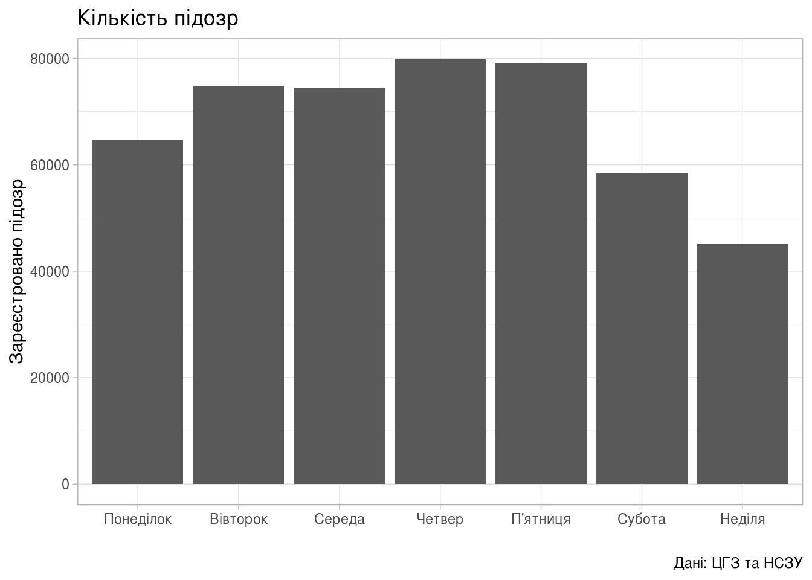

Гістограми
================

В продовження до попередньої статті «[Динаміка поширення коронавірусної інфекції по областях](regions_dyn.html)» побудуємо гістограми.

Дні, коли найбільше та найменше реєструють
------------------------------------------

Насправді це не зовсім гістограми, а швидше стовпчикові діаграми.

``` r
library(tidyverse)

area_dyn <- read_csv('../covid19_by_area_type_hosp_dynamics.csv')

area_dyn <- area_dyn %>%
    mutate(Weekday_Num = factor(strftime(zvit_date, format="%u"))) %>%
    mutate(Weekday_Name = factor(case_when(
               Weekday_Num == "1" ~ "Понеділок",
               Weekday_Num == "2" ~ "Вівторок",
               Weekday_Num == "3" ~ "Середа",
               Weekday_Num == "4" ~ "Четвер",
               Weekday_Num == "5" ~ "П'ятниця",
               Weekday_Num == "6" ~ "Субота",
               Weekday_Num == "7" ~ "Неділя",
               TRUE ~ "etc")))
```

``` r
dyn_by_day <- area_dyn %>%
    select(Weekday_Name, Weekday_Num, new_susp, new_confirm, new_death) %>%
    group_by(Weekday_Name) %>%
    summarise(Weekday_Num = first(Weekday_Num),
              new_susp = sum(new_susp),
              new_confirm = sum(new_confirm),
              new_death = sum(new_death))
```

Підозри
-------

``` r
(ggplot(dyn_by_day,
        aes(fct_reorder(Weekday_Name, Weekday_Num,
                        .fun=identity, .desc=FALSE),
            new_susp))
    + geom_bar(stat="identity")
    + theme_light()
    + labs(title="Кількість підозр",
           x = "",
           y = "Зареєстровано підозр",
           caption = "Дані: ЦГЗ та НСЗУ"))
```



Підтверджених випадків
----------------------

``` r
(ggplot(dyn_by_day,
        aes(fct_reorder(Weekday_Name, Weekday_Num,
                        .fun=identity, .desc=FALSE),
            new_confirm))
    + geom_bar(stat="identity")
    + theme_light()
    + labs(title="Кількість підтверджених",
           x = "",
           y = "Підтверджено випадків",
           caption = "Дані: ЦГЗ та НСЗУ"))
```


Смертей
-------

``` r
(ggplot(dyn_by_day, aes(x=Weekday_Num, y=new_death))
    + geom_bar(stat="identity")
    + theme_light()
    + labs(title="Летальних випадків",
           x = "Зареєстровано смертей",
           y = "",
           caption = "Дані: ЦГЗ та НСЗУ"))
```


Вік та стать хворих
===================

Вік
---

``` r
age_dyn <- area_dyn %>%
    group_by(person_age_group) %>%
    summarise(new_death = sum(new_death),
              new_confirm = sum(new_confirm)) %>%
    mutate(lethality = new_death / new_confirm)

age_dyn
```

    ## # A tibble: 6 x 4
    ##   person_age_group new_death new_confirm lethality
    ##   <chr>                <dbl>       <dbl>     <dbl>
    ## 1 0-5                      0         682   0      
    ## 2 06-17                    0        1718   0      
    ## 3 18-39                   32        9127   0.00351
    ## 4 40-64                  376       16017   0.0235 
    ## 5 65+                    505        4927   0.102  
    ## 6 Уточнюється              0           5   0

Летальних випадків в залежності від вікової групи хворого:

``` r
(ggplot(age_dyn, aes(person_age_group, new_death))
    + geom_col()
    + theme_light()
    + labs(title="",
           x = "",
           y = "",
           caption = "Дані: ЦГЗ та НСЗУ"))
```


Підтверджених хворих в залежності від вікової групи:

``` r
(ggplot(age_dyn, aes(person_age_group, new_confirm))
    + geom_col()
    + theme_light()
    + labs(title="",
           x = "",
           y = "",
           caption = "Дані: ЦГЗ та НСЗУ"))
```


Поточна летальність в залежності від вікової групи:

``` r
(ggplot(age_dyn, aes(person_age_group, lethality*100))
    + geom_col()
    + theme_light()
    + labs(title="Поточна летальність",
           x = "Вікова група",
           y = "Летальність (відсотків летальних до зареєстрованих)",
           caption = "Дані: ЦГЗ та НСЗУ"))
```


Стать
-----

Підтверджених хворих в залежності від статі:

``` r
gender_dyn <- area_dyn %>%
    group_by(person_gender) %>%
    summarise(new_death = sum(new_death),
              new_confirm = sum(new_confirm))
```

``` r
(ggplot(gender_dyn, aes(person_gender, new_death))
    + geom_col()
    + theme_light()
    + labs(title="Кількість летальних випадків",
           x = "Стать",
           y = "Летальних випадків",
           caption = "Дані: ЦГЗ та НСЗУ"))
```


``` r
(ggplot(gender_dyn, aes(person_gender, new_confirm))
    + geom_col()
    + theme_light()
    + labs(title="",
           x = "",
           y = "",
           caption = "Дані: ЦГЗ та НСЗУ"))
```


[Повернутись на головну](index.html) або [повідомити про помилку]((https://github.com/vityok/covid19_ua/issues))
