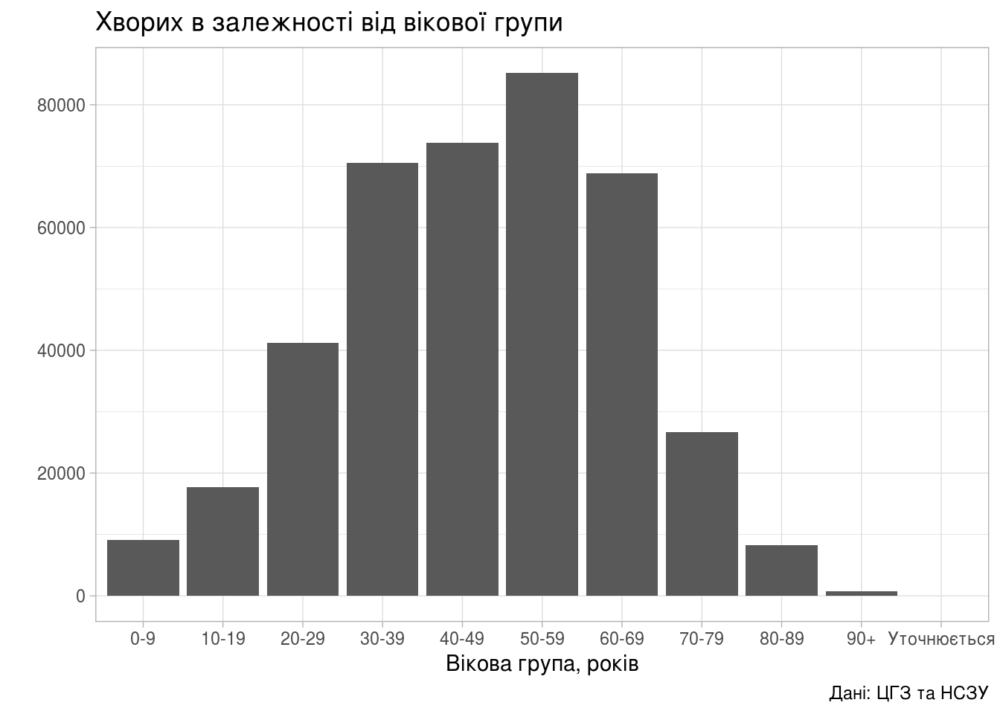
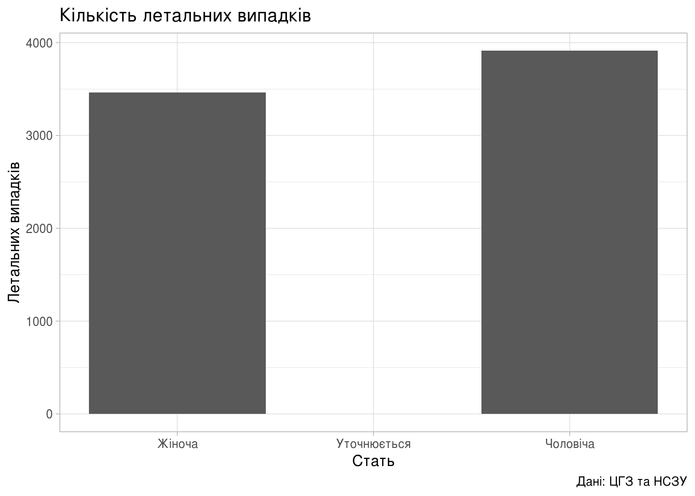

Гістограми
================

В продовження до попередньої статті «[Динаміка поширення коронавірусної інфекції по областях](regions_dyn.html)» побудуємо гістограми.

Дні, коли найбільше та найменше реєструють
------------------------------------------

Насправді далі будуть побудовані не зовсім гістограми, а швидше стовпчикові діаграми. Гістограми візуально схожі на стовпчикові діаграми, але вони служать для зображення розподілу ймовірностей однієї випадкової величини. Діапазон значень ділять на інтервали, а висота стовпчиків визначається частоту появи значення випадкової змінної в даному інтервалі.

Більше інформації про гістограми можна прочитати у [Вікіпедії](https://uk.wikipedia.org/wiki/%D0%93%D1%96%D1%81%D1%82%D0%BE%D0%B3%D1%80%D0%B0%D0%BC%D0%B0).

``` r
library(tidyverse)

area_dyn <- read_csv('../covid19_by_area_type_hosp_dynamics.csv')

area_dyn <- area_dyn %>%
    mutate(Weekday_Num = factor(strftime(zvit_date, format="%u"))) %>%
    mutate(Weekday_Name = factor(case_when(
               Weekday_Num == "1" ~ "Понеділок",
               Weekday_Num == "2" ~ "Вівторок",
               Weekday_Num == "3" ~ "Середа",
               Weekday_Num == "4" ~ "Четвер",
               Weekday_Num == "5" ~ "П'ятниця",
               Weekday_Num == "6" ~ "Субота",
               Weekday_Num == "7" ~ "Неділя",
               TRUE ~ "etc")))
```

``` r
dyn_by_day <- area_dyn %>%
    select(Weekday_Name, Weekday_Num, new_susp, new_confirm, new_death) %>%
    group_by(Weekday_Name) %>%
    summarise(Weekday_Num = first(Weekday_Num),
              new_susp = sum(new_susp),
              new_confirm = sum(new_confirm),
              new_death = sum(new_death))
```

Підозри
-------

``` r
(ggplot(dyn_by_day,
        aes(fct_reorder(Weekday_Name, Weekday_Num,
                        .fun=identity, .desc=FALSE),
            new_susp))
    + geom_bar(stat="identity")
    + theme_light()
    + labs(title="Кількість підозр",
           x = "",
           y = "Зареєстровано підозр",
           caption = "Дані: ЦГЗ та НСЗУ"))
```


Підтверджених випадків
----------------------

``` r
(ggplot(dyn_by_day,
        aes(fct_reorder(Weekday_Name, Weekday_Num,
                        .fun=identity, .desc=FALSE),
            new_confirm))
    + geom_bar(stat="identity")
    + theme_light()
    + labs(title="Кількість підтверджених",
           x = "",
           y = "Підтверджено випадків",
           caption = "Дані: ЦГЗ та НСЗУ"))
```


Смертей
-------

``` r
(ggplot(dyn_by_day,
        aes(fct_reorder(Weekday_Name, Weekday_Num,
                        .fun=identity, .desc=FALSE),
            new_death))
    + geom_bar(stat="identity")
    + theme_light()
    + labs(title="Летальних випадків",
           x = "Зареєстровано смертей",
           y = "",
           caption = "Дані: ЦГЗ та НСЗУ"))
```


Вік та стать хворих
===================

Вік
---

``` r
age_dyn <- area_dyn %>%
    group_by(person_age_group) %>%
    summarise(new_death = sum(new_death),
              new_confirm = sum(new_confirm)) %>%
    mutate(lethality = new_death / new_confirm)
```

| person\_age\_group |  new\_death|  new\_confirm|  lethality|
|:-------------------|-----------:|-------------:|----------:|
| 0-5                |           0|           777|  0.0000000|
| 06-17              |           0|          1950|  0.0000000|
| 18-39              |          34|         10396|  0.0032705|
| 40-64              |         415|         18328|  0.0226430|
| 65+                |         563|          5782|  0.0973712|
| Уточнюється        |           0|             8|  0.0000000|

Летальних випадків в залежності від вікової групи хворого:

``` r
(ggplot(age_dyn, aes(person_age_group, new_death))
    + geom_col()
    + theme_light()
    + labs(title="Летальних випадків в залежності від вікової когорти",
           x = "Вікова когорта, років",
           y = "",
           caption = "Дані: ЦГЗ та НСЗУ"))
```


Підтверджених хворих в залежності від вікової групи:

``` r
(ggplot(age_dyn, aes(person_age_group, new_confirm))
    + geom_col()
    + theme_light()
    + labs(title="Хворих в залежності від вікової когорти",
           x = "Вікова когорта, років",
           y = "",
           caption = "Дані: ЦГЗ та НСЗУ"))
```



Поточна летальність в залежності від вікової групи:

``` r
(ggplot(age_dyn, aes(person_age_group, lethality*100))
    + geom_col()
    + theme_light()
    + labs(title="Поточна летальність",
           x = "Вікова когорта, років",
           y = "Летальність (відсотків летальних до зареєстрованих)",
           caption = "Дані: ЦГЗ та НСЗУ"))
```


Стать
-----

Підтверджених хворих в залежності від статі:

``` r
gender_dyn <- area_dyn %>%
    group_by(person_gender) %>%
    summarise(new_death = sum(new_death),
              new_confirm = sum(new_confirm)) %>%
    mutate(lethality = new_death / new_confirm)
```

| person\_gender |  new\_death|  new\_confirm|  lethality|
|:---------------|-----------:|-------------:|----------:|
| Жіноча         |         465|         21427|  0.0217016|
| Уточнюється    |           2|           378|  0.0052910|
| Чоловіча       |         545|         15436|  0.0353071|

Тепер можна будувати графіки.

``` r
(ggplot(gender_dyn, aes(person_gender, new_death))
    + geom_col()
    + theme_light()
    + labs(title="Кількість летальних випадків",
           x = "Стать",
           y = "Летальних випадків",
           caption = "Дані: ЦГЗ та НСЗУ"))
```



Підтверджених випадків в залежності від статі.

``` r
(ggplot(gender_dyn, aes(person_gender, new_confirm))
    + geom_col()
    + theme_light()
    + labs(title="",
           x = "",
           y = "",
           caption = "Дані: ЦГЗ та НСЗУ"))
```


Поточна летальність в залежності від статі:

``` r
(ggplot(gender_dyn, aes(person_gender, lethality))
    + geom_col()
    + theme_light()
    + labs(title="Поточна летальність",
           x = "",
           y = "",
           caption = "Дані: ЦГЗ та НСЗУ"))
```


Все разом
=========

Спробуємо побудувати графік, на якому буде водночас показано три параметра: вік, стать, летальність хвороби.

Серед іншого, будуть відкинуті рядки, в яких вікова когорта або стать пацієнта не визначено (вказано «Уточнюється»). Це зроблено із використанням функції `filter`.

``` r
age_gender_dyn <- area_dyn %>%
    group_by(person_age_group, person_gender) %>%
    filter(person_age_group != "Уточнюється" & person_gender != "Уточнюється") %>%
    summarise(new_death = sum(new_death),
              new_confirm = sum(new_confirm)) %>%
    mutate(lethality = new_death / new_confirm)
```

| person\_age\_group | person\_gender |  new\_death|  new\_confirm|  lethality|
|:-------------------|:---------------|-----------:|-------------:|----------:|
| 0-5                | Жіноча         |           0|           353|  0.0000000|
| 0-5                | Чоловіча       |           0|           386|  0.0000000|
| 06-17              | Жіноча         |           0|           959|  0.0000000|
| 06-17              | Чоловіча       |           0|           975|  0.0000000|
| 18-39              | Жіноча         |          14|          5807|  0.0024109|
| 18-39              | Чоловіча       |          20|          4493|  0.0044514|
| 40-64              | Жіноча         |         162|         10914|  0.0148433|
| 40-64              | Чоловіча       |         252|          7233|  0.0348403|
| 65+                | Жіноча         |         289|          3388|  0.0853011|
| 65+                | Чоловіча       |         273|          2348|  0.1162692|

Тепер можна побудувати графік.

``` r
(ggplot(age_gender_dyn, aes(person_gender, person_age_group))
    + geom_raster(aes(fill=lethality))
    + scale_fill_distiller(palette="OrRd",
                           direction=1,
                           name="Летальність")
    + labs(title="Летальність в залежності від віку та статі",
           x = "Стать",
           y = "Вікова когорта, років",
           caption = "Дані: ЦГЗ та НСЗУ")
    + theme_light())
```


Тут чітко видно, що найбільший ризик COVID-19 становить для літніх чоловіків, поточна летальність для яких становить 11.63%; водночас, поточна летальність для жінок та дівчат менша, аніж для чоловіків та хлопчиків — 2.17% та 3.53% відповідно.

[Повернутись на головну](index.html) або [повідомити про помилку](https://github.com/vityok/covid19_ua/issues)
