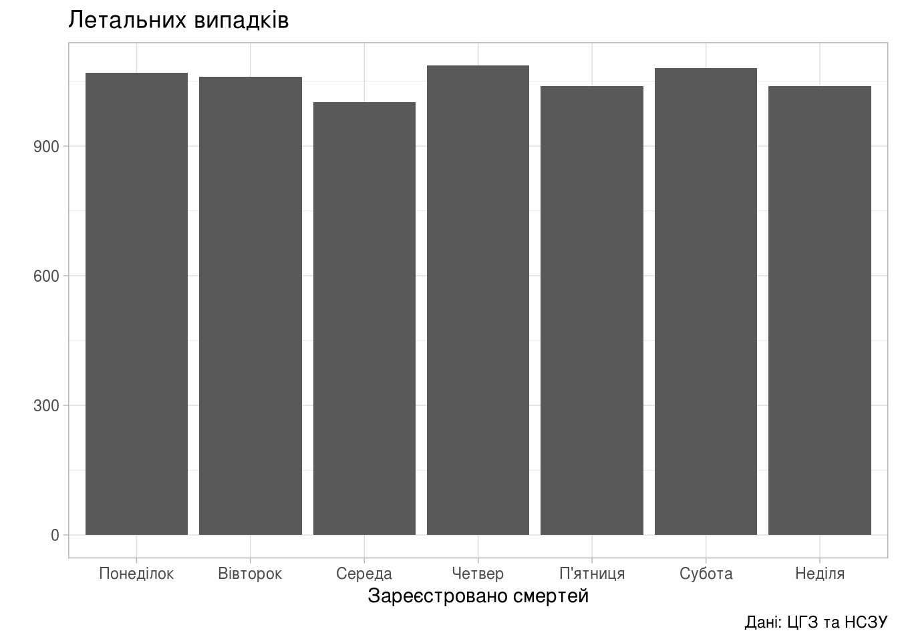
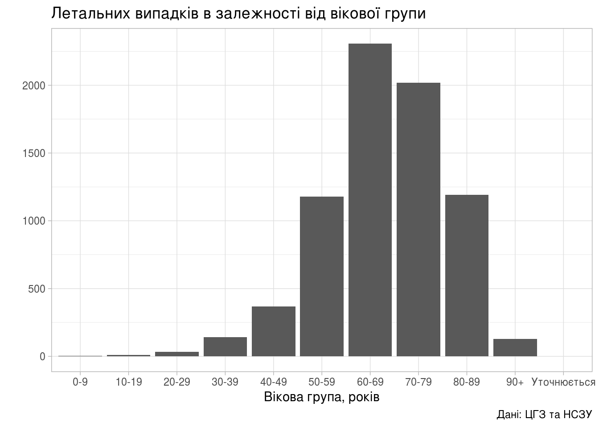

Гістограми
================

В продовження до попередньої статті «[Динаміка поширення коронавірусної інфекції по областях](regions_dyn.html)» побудуємо гістограми.

Коли найбільше та найменше реєструють
=====================================

Насправді далі будуть побудовані не зовсім гістограми, а швидше стовпчикові діаграми. Гістограми візуально схожі на стовпчикові діаграми, але вони служать для зображення розподілу ймовірностей однієї випадкової величини. Діапазон значень ділять на інтервали, а висота стовпчиків визначаєт частоту появи значення випадкової змінної в цьому інтервалі.

Більше інформації про гістограми можна знайти у [Вікіпедії](https://uk.wikipedia.org/wiki/%D0%93%D1%96%D1%81%D1%82%D0%BE%D0%B3%D1%80%D0%B0%D0%BC%D0%B0).

``` r
library(tidyverse)

area_dyn <- read_csv('../covid19_by_area_type_hosp_dynamics.csv')

area_dyn <- area_dyn %>%
    mutate(Weekday_Num = factor(strftime(zvit_date, format="%u"))) %>%
    mutate(Weekday_Name = factor(case_when(
               Weekday_Num == "1" ~ "Понеділок",
               Weekday_Num == "2" ~ "Вівторок",
               Weekday_Num == "3" ~ "Середа",
               Weekday_Num == "4" ~ "Четвер",
               Weekday_Num == "5" ~ "П'ятниця",
               Weekday_Num == "6" ~ "Субота",
               Weekday_Num == "7" ~ "Неділя",
               TRUE ~ "etc")))
```

``` r
dyn_by_day <- area_dyn %>%
    select(Weekday_Name, Weekday_Num, new_susp, new_confirm, new_death) %>%
    group_by(Weekday_Name) %>%
    summarise(Weekday_Num = first(Weekday_Num),
              new_susp = sum(new_susp),
              new_confirm = sum(new_confirm),
              new_death = sum(new_death))
```

    ## `summarise()` ungrouping output (override with `.groups` argument)

Підозри
-------

``` r
(ggplot(dyn_by_day,
        aes(fct_reorder(Weekday_Name, Weekday_Num,
                        .fun=identity, .desc=FALSE),
            new_susp))
    + geom_bar(stat="identity")
    + theme_light()
    + labs(title="Кількість підозр",
           x = "",
           y = "Зареєстровано підозр",
           caption = "Дані: ЦГЗ та НСЗУ"))
```


Підтверджених випадків
----------------------

``` r
(ggplot(dyn_by_day,
        aes(fct_reorder(Weekday_Name, Weekday_Num,
                        .fun=identity, .desc=FALSE),
            new_confirm))
    + geom_bar(stat="identity")
    + theme_light()
    + labs(title="Кількість підтверджених",
           x = "",
           y = "Підтверджено випадків",
           caption = "Дані: ЦГЗ та НСЗУ"))
```


Смертей
-------

``` r
(ggplot(dyn_by_day,
        aes(fct_reorder(Weekday_Name, Weekday_Num,
                        .fun=identity, .desc=FALSE),
            new_death))
    + geom_bar(stat="identity")
    + theme_light()
    + labs(title="Летальних випадків",
           x = "Зареєстровано смертей",
           y = "",
           caption = "Дані: ЦГЗ та НСЗУ"))
```



Вік та стать хворих
===================

Вік
---

``` r
age_dyn <- area_dyn %>%
    group_by(person_age_group) %>%
    summarise(new_death = sum(new_death),
              new_confirm = sum(new_confirm)) %>%
    mutate(lethality = new_death / new_confirm)
```

    ## `summarise()` ungrouping output (override with `.groups` argument)

| person\_age\_group |  new\_death|  new\_confirm|  lethality|
|:-------------------|-----------:|-------------:|----------:|
| 0-9                |           3|          9159|  0.0003275|
| 10-19              |          10|         17758|  0.0005631|
| 20-29              |          32|         41218|  0.0007764|
| 30-39              |         142|         70550|  0.0020128|
| 40-49              |         367|         73845|  0.0049699|
| 50-59              |        1178|         85144|  0.0138354|
| 60-69              |        2306|         68826|  0.0335048|
| 70-79              |        2018|         26702|  0.0755749|
| 80-89              |        1190|          8280|  0.1437198|
| 90+                |         129|           699|  0.1845494|
| Уточнюється        |           0|            12|  0.0000000|

Летальних випадків в залежності від вікової групи хворого:

``` r
(ggplot(age_dyn, aes(person_age_group, new_death))
    + geom_col()
    + theme_light()
    + labs(title="Летальних випадків в залежності від вікової групи",
           x = "Вікова група, років",
           y = "",
           caption = "Дані: ЦГЗ та НСЗУ"))
```



Підтверджених хворих в залежності від вікової групи:

``` r
(ggplot(age_dyn, aes(person_age_group, new_confirm))
    + geom_col()
    + theme_light()
    + labs(title="Хворих в залежності від вікової групи",
           x = "Вікова група, років",
           y = "",
           caption = "Дані: ЦГЗ та НСЗУ"))
```


Поточна летальність в залежності від вікової групи:

``` r
(ggplot(age_dyn, aes(person_age_group, lethality*100))
    + geom_col()
    + theme_light()
    + labs(title="Поточна летальність",
           x = "Вікова група, років",
           y = "Летальність (відсотків летальних до зареєстрованих)",
           caption = "Дані: ЦГЗ та НСЗУ"))
```


Стать
-----

Підтверджених хворих в залежності від статі:

``` r
gender_dyn <- area_dyn %>%
    group_by(person_gender) %>%
    summarise(new_death = sum(new_death),
              new_confirm = sum(new_confirm)) %>%
    mutate(lethality = new_death / new_confirm)
```

    ## `summarise()` ungrouping output (override with `.groups` argument)

| person\_gender |  new\_death|  new\_confirm|  lethality|
|:---------------|-----------:|-------------:|----------:|
| Жіноча         |        3463|        239785|  0.0144421|
| Уточнюється    |           0|             1|  0.0000000|
| Чоловіча       |        3912|        162407|  0.0240876|

Тепер можна будувати графіки.

``` r
(ggplot(gender_dyn, aes(person_gender, new_death))
    + geom_col()
    + theme_light()
    + labs(title="Кількість летальних випадків",
           x = "Стать",
           y = "Летальних випадків",
           caption = "Дані: ЦГЗ та НСЗУ"))
```


Підтверджених випадків в залежності від статі.

``` r
(ggplot(gender_dyn, aes(person_gender, new_confirm))
    + geom_col()
    + theme_light()
    + labs(title="",
           x = "",
           y = "",
           caption = "Дані: ЦГЗ та НСЗУ"))
```


Поточна летальність в залежності від статі:

``` r
(ggplot(gender_dyn, aes(person_gender, lethality))
    + geom_col()
    + theme_light()
    + labs(title="Поточна летальність",
           x = "",
           y = "",
           caption = "Дані: ЦГЗ та НСЗУ"))
```


Вік та стать разом
------------------

Спробуємо побудувати графік, на якому буде водночас показано три параметра: вік, стать, летальність хвороби.

Серед іншого, будуть відкинуті рядки, в яких вікова група або стать пацієнта не визначено (вказано «Уточнюється»). Це зроблено із використанням функції `filter`.

``` r
age_gender_dyn <- area_dyn %>%
    group_by(person_age_group, person_gender) %>%
    filter(person_age_group != "Уточнюється" & person_gender != "Уточнюється") %>%
    summarise(new_death = sum(new_death),
              new_confirm = sum(new_confirm)) %>%
    mutate(lethality = new_death / new_confirm)
```

    ## `summarise()` regrouping output by 'person_age_group' (override with `.groups` argument)

| person\_age\_group | person\_gender |  new\_death|  new\_confirm|  lethality|
|:-------------------|:---------------|-----------:|-------------:|----------:|
| 0-9                | Жіноча         |           0|          4465|  0.0000000|
| 0-9                | Чоловіча       |           3|          4694|  0.0006391|
| 10-19              | Жіноча         |           3|          9028|  0.0003323|
| 10-19              | Чоловіча       |           7|          8730|  0.0008018|
| 20-29              | Жіноча         |          15|         23165|  0.0006475|
| 20-29              | Чоловіча       |          17|         18053|  0.0009417|
| 30-39              | Жіноча         |          67|         40849|  0.0016402|
| 30-39              | Чоловіча       |          75|         29700|  0.0025253|
| 40-49              | Жіноча         |         161|         45222|  0.0035602|
| 40-49              | Чоловіча       |         206|         28623|  0.0071970|
| 50-59              | Жіноча         |         561|         54022|  0.0103847|
| 50-59              | Чоловіча       |         617|         31122|  0.0198252|
| 60-69              | Жіноча         |        1014|         41754|  0.0242851|
| 60-69              | Чоловіча       |        1292|         27072|  0.0477246|
| 70-79              | Жіноча         |         959|         15815|  0.0606386|
| 70-79              | Чоловіча       |        1059|         10887|  0.0972720|
| 80-89              | Жіноча         |         614|          5012|  0.1225060|
| 80-89              | Чоловіча       |         576|          3268|  0.1762546|
| 90+                | Жіноча         |          69|           445|  0.1550562|
| 90+                | Чоловіча       |          60|           254|  0.2362205|

Тепер можна побудувати графік.

``` r
(ggplot(age_gender_dyn, aes(person_gender, person_age_group))
    + geom_raster(aes(fill=lethality))
    + scale_fill_distiller(palette="OrRd",
                           direction=1,
                           name="Летальність")
    + labs(title="Летальність в залежності від віку та статі",
           x = "Стать",
           y = "Вікова група, років",
           caption = "Дані: ЦГЗ та НСЗУ")
    + theme_light())
```


Тут чітко видно, що найбільший ризик COVID-19 становить для літніх чоловіків, поточна летальність для яких становить ; водночас, поточна летальність для жінок та дівчат менша, аніж для чоловіків та хлопчиків — 1.44% та 2.41% відповідно.

Те, що найбільший ризик SARS-CoV-2 становить для літніх чоловіків, в цілому, збігається з іншими дослідженнями, зокрема, з [аналізом смертності в Італії в перші місяці епідемії](https://doi.org/10.2807/1560-7917.ES.2020.25.19.2000620).

Лідери
======

Спробуємо дізнатись, в яких областях найбільше зростає кількість хворих. На жаль, дані за кілька попердніх днів можуть [бути занижені](https://texty.org.ua/projects/101219/epidemiya-covid-19-v-oblastyah/):

> Тому що у найбільш свіжих даних НСЗУ (приблизно за 5-7 останніх днів) нових захворювань менше, ніж є насправді (частину випадків за вчора, позавчора тощо ще не встигли підтвердити тестами або звітувати про них).

Аби обмежити вплив недоліків звітування на результати, відкинемо дані за попередні три дні, та обчислимо кількість зареєстровних випадків захворювання та підозр за 7 днів до того.

``` r
area_sum <- area_dyn %>%
    group_by(zvit_date, registration_area) %>%
    summarise(new_susp = sum(new_susp),
              new_confirm = sum(new_confirm),
              active_confirm = sum(active_confirm))
```

    ## `summarise()` regrouping output by 'zvit_date' (override with `.groups` argument)

``` r
scope <- head(tail(unique(area_sum$zvit_date), 14), 7)

area_scoped_sum <- area_sum %>%
    filter(zvit_date %in% scope) %>%
    group_by(registration_area) %>%
    summarise(new_susp = sum(new_susp),
              new_confirm = sum(new_confirm),
              active_confirm = sum(active_confirm))
```

    ## `summarise()` ungrouping output (override with `.groups` argument)

``` r
top_confirm <- head(arrange(area_scoped_sum, desc(new_confirm)),10)
top_susp <- head(arrange(area_scoped_sum, desc(new_susp)),10)
top_active <- head(arrange(area_scoped_sum, desc(active_confirm)),10)
```

[Повернутись на головну](index.html) або [повідомити про помилку](https://github.com/vityok/covid19_ua/issues)
