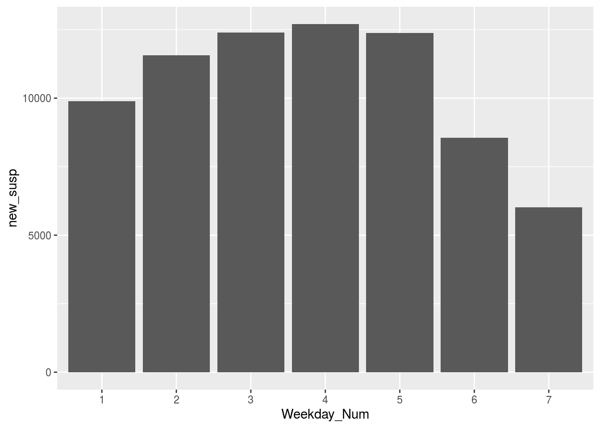
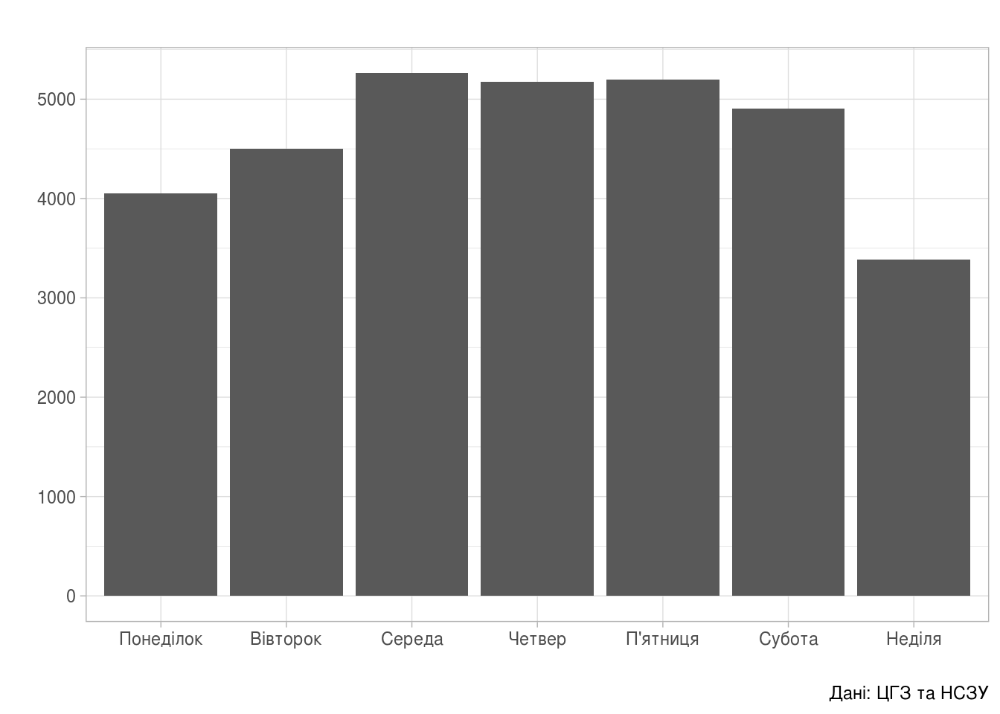
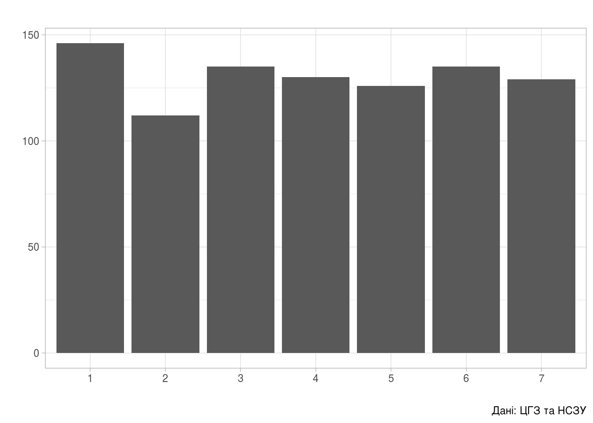

Гістограми
================

В продовження до попередньої статті «[Динаміка поширення коронавірусної інфекції по областях](regions_dyn.html)» побудуємо гістограми.

Дні, коли найбільше та найменше реєструють
------------------------------------------

``` r
library(tidyverse)
Sys.setlocale(category="LC_ALL",locale="uk_UA.utf8" )
```

``` r
area_dyn <- read_csv('../covid19_by_area_type_hosp_dynamics.csv')
```

    ## Parsed with column specification:
    ## cols(
    ##   zvit_date = col_date(format = ""),
    ##   registration_area = col_character(),
    ##   priority_hosp_area = col_character(),
    ##   edrpou_hosp = col_character(),
    ##   legal_entity_name_hosp = col_character(),
    ##   legal_entity_lat = col_double(),
    ##   legal_entity_lng = col_double(),
    ##   person_gender = col_character(),
    ##   person_age_group = col_character(),
    ##   add_conditions = col_character(),
    ##   is_medical_worker = col_character(),
    ##   new_susp = col_double(),
    ##   new_confirm = col_double(),
    ##   active_confirm = col_double(),
    ##   new_death = col_double(),
    ##   new_recover = col_double()
    ## )

    ## Warning: 86 parsing failures.
    ##  row              col               expected  actual                                        file
    ## 1300 legal_entity_lat no trailing characters ,006038 '../covid19_by_area_type_hosp_dynamics.csv'
    ## 1300 legal_entity_lng no trailing characters ,655758 '../covid19_by_area_type_hosp_dynamics.csv'
    ## 1392 legal_entity_lat no trailing characters ,604941 '../covid19_by_area_type_hosp_dynamics.csv'
    ## 1392 legal_entity_lng no trailing characters ,271351 '../covid19_by_area_type_hosp_dynamics.csv'
    ## 3283 legal_entity_lat no trailing characters ,604941 '../covid19_by_area_type_hosp_dynamics.csv'
    ## .... ................ ...................... ....... ...........................................
    ## See problems(...) for more details.

``` r
area_dyn <- area_dyn %>%
    mutate(Weekday_Num = factor(strftime(zvit_date, format="%u"))) %>%
    mutate(Weekday_Name = factor(case_when(
               Weekday_Num == "1" ~ "Понеділок",
               Weekday_Num == "2" ~ "Вівторок",
               Weekday_Num == "3" ~ "Середа",
               Weekday_Num == "4" ~ "Четвер",
               Weekday_Num == "5" ~ "П'ятниця",
               Weekday_Num == "6" ~ "Субота",
               Weekday_Num == "7" ~ "Неділя",
               TRUE ~ "etc")))
```

``` r
dyn_by_day <- area_dyn %>%
    select(Weekday_Name, Weekday_Num, new_susp, new_confirm, new_death) %>%
    group_by(Weekday_Name) %>%
    summarise(Weekday_Num = first(Weekday_Num),
              new_susp = sum(new_susp),
              new_confirm = sum(new_confirm),
              new_death = sum(new_death))
```

``` r
(ggplot(dyn_by_day, aes(x=Weekday_Num, y=new_susp))
    + geom_bar(stat="identity"))
```



``` r
(ggplot(dyn_by_day, aes(x=Weekday_Num, y=new_confirm))
    + geom_bar(stat="identity"))
```



``` r
(ggplot(dyn_by_day, aes(x=Weekday_Num, y=new_death))
    + geom_bar(stat="identity"))
```



[Повернутись на головну](index.html) або [повідомити про помилку]((https://github.com/vityok/covid19_ua/issues))
