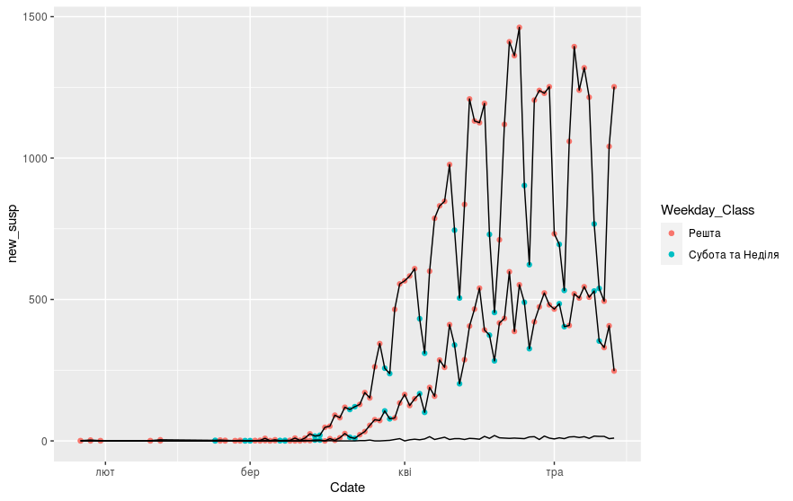

Аналіз часових рядів на прикладі даних про поширення COVID-19 в Україні в 2020 році
=============================================================================

*В роботі*.

Досліди не претендують на наукову повноту та є простими експериментами
з використання пакету програм R для аналізу статистичних даних.

Всі зауваження та пропозиції залишати [тут](https://github.com/vityok/covid19_ua/issues).

Дивіться [charts_ua.R](charts_ua.R) з текстом програми, якою було
побудовано ці графіки.

Іще графіки:
 - [Динаміка поширення коронавірусної інфекції по областях](regions_dyn.html)
 - [Гістограми](histograms.html) (в роботі)
 - [Прогнозування](forecast.html) (в роботі)

Загальний огляд
---------------

Динаміка поширення коронавірусної інфекції.

Інший метод побудови, лінії різного кольору.

Модель Холта-Вінтерса та прогноз на 14 днів, зроблений 12 травня (на
основі даних до 11 травня).

