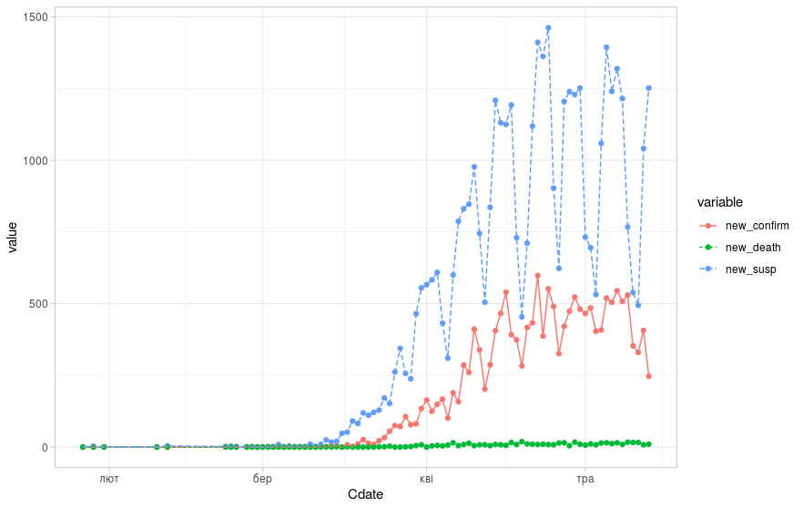

Аналіз часових рядів на прикладі даних про поширення COVID-19 в Україні в 2020 році
=============================================================================

*В роботі*.

Досліди не претендують на наукову повноту та є простими експериментами
з використання пакету програм R для аналізу статистичних даних.

Дивіться [charts_ua.R](charts_ua.R) з текстом програми, якою було
побудовано ці графіки.

 - [Динаміка поширення коронавірусної інфекції по областях](regions_dyn.html)
