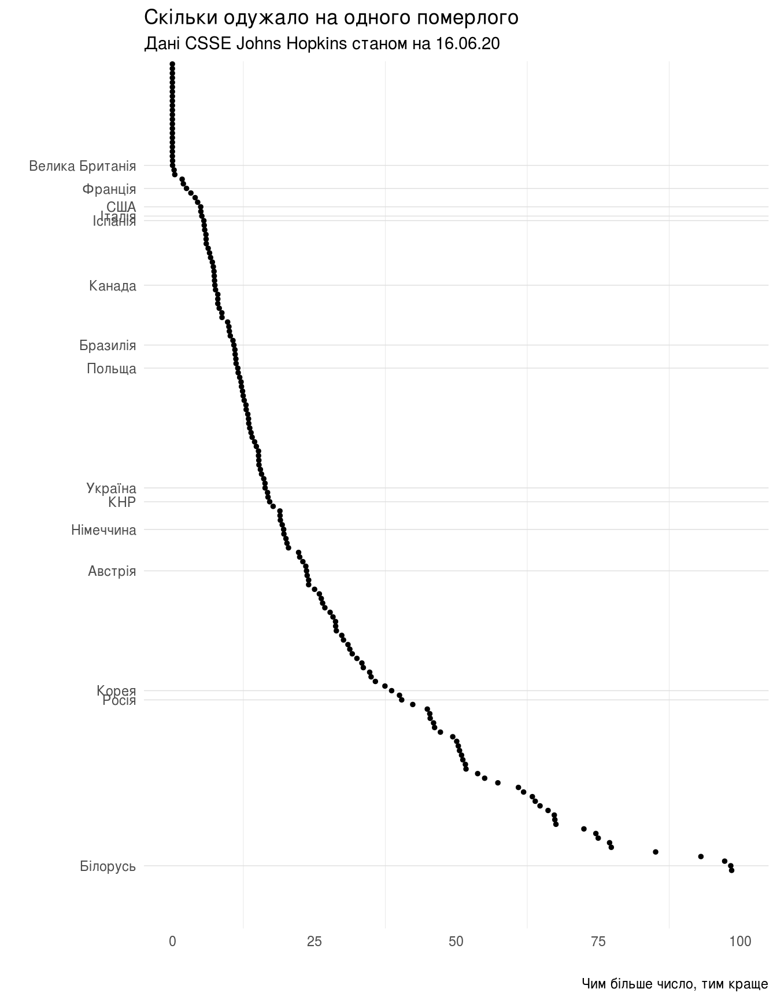
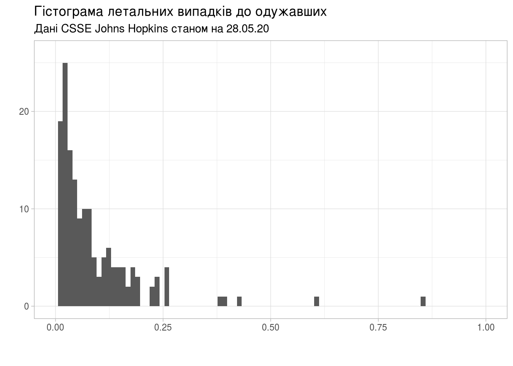
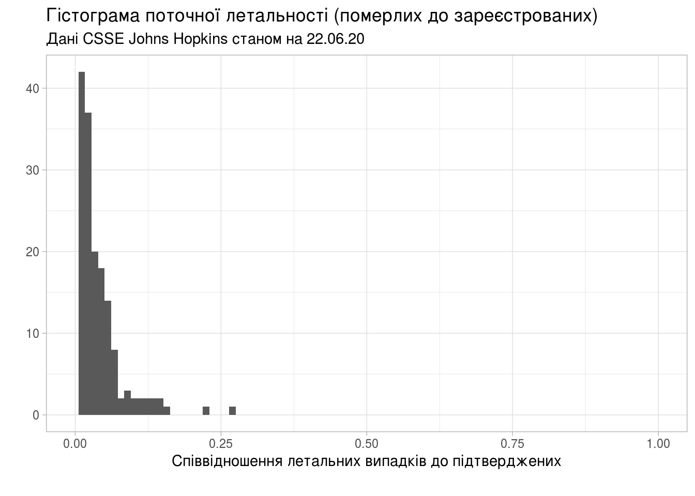
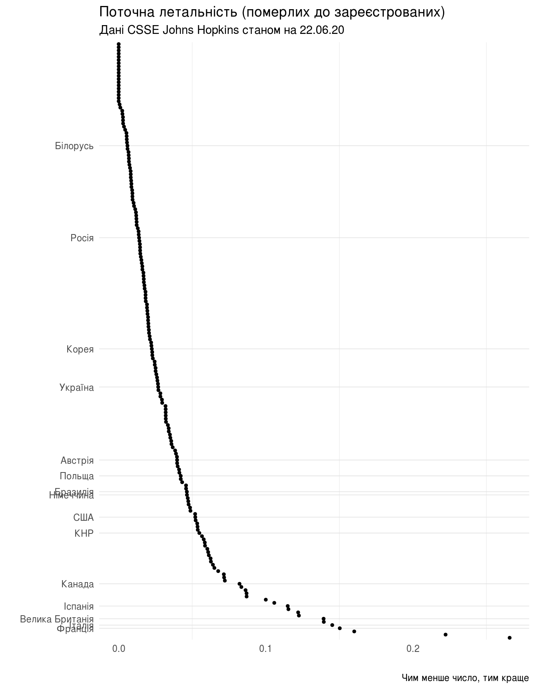
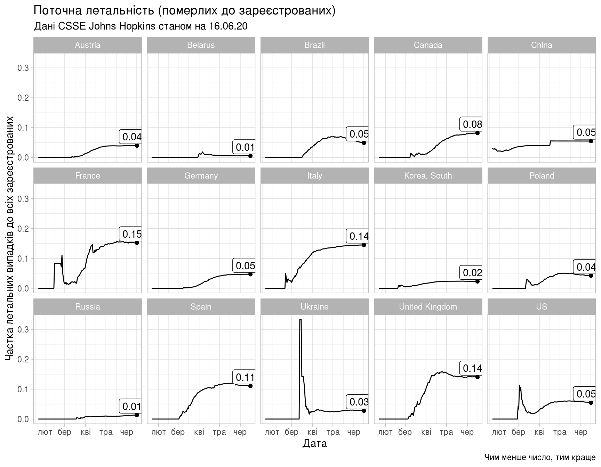

Як зчитувати та обробляти дані, оприлюднені інститутом Джонса Хопкінза
================

(в роботі): Як зчитувати та обробляти в R дані, оприлюднені інститутом Джонса Хопкінза: `csse_covid_19_data`

``` r
library(tidyverse)
```

Часові ряди CSSE
================

Часові ряди зібрані центром CSSE інституту Johns Hopkins знаходяться у вільному доступі в репозиторії на GitHub: [`csse_covid_19_time_series`](https://github.com/CSSEGISandData/COVID-19/tree/master/csse_covid_19_data/csse_covid_19_time_series). Нас цікавитимуть три часових ряда, які містять сумарні показники на певну дату:

-   `time_series_covid19_confirmed_global.csv`: кількість підтверджених випадків захворювання на коронавірус,
-   `time_series_covid19_deaths_global.csv`: кількість померлих,
-   `time_series_covid19_recovered_global.csv`: скільки одужало.

Всі три файла мають подібну структуру, особливістю якої є те, що для окремих країн показники розбито за регіонами, а дата, коли показник зареєстровано, вказана в назві стовпчика.

Така структура даних не дуже добре підходить для зручної обробки в пакеті `tidyverse` системи R. [Бажано, аби](https://r4ds.had.co.nz/tidy-data.html#tidy-data-1):

1.  Кожна змінна мала власний стовпчик.
2.  Кожне вимірювання — власний рядок.
3.  Кожне значення — власну комірку.

Тобто, бажано отримати дані, представлені як таблиця зі стовпчиками:

-   Країна,
-   Дата,
-   Кількість підтверджених випадків,
-   -//- летальних,
-   -//- одужало.

Хоча стовпчик «Дата» может бути не завжди потрібен.

Зчитування даних про кількість підтверджених випадків.

``` r
confirmed_global_csv <- read_csv('../../COVID-19/csse_covid_19_data/csse_covid_19_time_series/time_series_covid19_confirmed_global.csv')
```

    ## Parsed with column specification:
    ## cols(
    ##   .default = col_double(),
    ##   `Province/State` = col_character(),
    ##   `Country/Region` = col_character()
    ## )

    ## See spec(...) for full column specifications.

``` r
confirmed_global <- confirmed_global_csv %>%
    pivot_longer(cols=contains("/20"), names_to="Date", values_to="Confirmed") %>%
    mutate(Date=as.Date(Date,format='%m/%d/%Y'))

confirmed_global_sum <- confirmed_global %>%
    select(Country = `Country/Region`, Confirmed, Date) %>%
    group_by(Country, Date) %>%
    summarise(Confirmed = sum(Confirmed))

head(confirmed_global_sum)
```

    ## # A tibble: 6 x 3
    ## # Groups:   Country [1]
    ##   Country     Date       Confirmed
    ##   <chr>       <date>         <dbl>
    ## 1 Afghanistan 20-01-22           0
    ## 2 Afghanistan 20-01-23           0
    ## 3 Afghanistan 20-01-24           0
    ## 4 Afghanistan 20-01-25           0
    ## 5 Afghanistan 20-01-26           0
    ## 6 Afghanistan 20-01-27           0

``` r
length(confirmed_global_sum$Confirmed)
```

    ## [1] 23876

Зчитування даних про кількість летальних випадків.

``` r
deaths_global_csv <- read_csv('../../COVID-19/csse_covid_19_data/csse_covid_19_time_series/time_series_covid19_deaths_global.csv')
```

    ## Parsed with column specification:
    ## cols(
    ##   .default = col_double(),
    ##   `Province/State` = col_character(),
    ##   `Country/Region` = col_character()
    ## )

    ## See spec(...) for full column specifications.

``` r
deaths_global <- deaths_global_csv %>%
    pivot_longer(cols=contains("/20"), names_to="Date", values_to="Deaths") %>%
    mutate(Date=as.Date(Date,format='%m/%d/%Y'))

deaths_global_sum <- deaths_global %>%
    select(Country = `Country/Region`, Deaths, Date) %>%
    group_by(Country, Date) %>%
    summarise(Deaths = sum(Deaths))
```

Зчитування даних про кількість тих, хто одужав.

``` r
recovered_global_csv <- read_csv('../../COVID-19/csse_covid_19_data/csse_covid_19_time_series/time_series_covid19_recovered_global.csv')
```

    ## Parsed with column specification:
    ## cols(
    ##   .default = col_double(),
    ##   `Province/State` = col_character(),
    ##   `Country/Region` = col_character()
    ## )

    ## See spec(...) for full column specifications.

``` r
recovered_global <- recovered_global_csv %>%
    pivot_longer(cols=contains("/20"), names_to="Date", values_to="Recovered") %>%
    mutate(Date=as.Date(Date,format='%m/%d/%Y'))

recovered_global_sum <- recovered_global %>%
    select(Country = `Country/Region`, Recovered, Date) %>%
    group_by(Country, Date) %>%
    summarise(Recovered = sum(Recovered))
```

Об'єднаємо три набори даних в один:

``` r
all_sum_raw <- deaths_global_sum %>%
    full_join(confirmed_global_sum, by=c('Country', 'Date')) %>%
    full_join(recovered_global_sum, by=c('Country', 'Date'))

head(all_sum_raw)
```

    ## # A tibble: 6 x 5
    ## # Groups:   Country [1]
    ##   Country     Date       Deaths Confirmed Recovered
    ##   <chr>       <date>      <dbl>     <dbl>     <dbl>
    ## 1 Afghanistan 20-01-22        0         0         0
    ## 2 Afghanistan 20-01-23        0         0         0
    ## 3 Afghanistan 20-01-24        0         0         0
    ## 4 Afghanistan 20-01-25        0         0         0
    ## 5 Afghanistan 20-01-26        0         0         0
    ## 6 Afghanistan 20-01-27        0         0         0

``` r
length(all_sum_raw$Country)
```

    ## [1] 23876

Обчислимо співвідношення:

``` r
all_stat <- all_sum_raw %>%
    mutate(Deaths_To_Recovered = if_else(Recovered > 0,
                                         Deaths / Recovered,
                                         0),
           Deaths_To_Confirmed = if_else(Confirmed > 0,
                                         Deaths / Confirmed,
                                         0),
           Recovered_To_Confirmed = Recovered / Confirmed,
           Recovered_To_Deaths = if_else(Deaths > 0,
                                         Recovered / Deaths,
                                         0),
           Active_To_Confirmed = (
               (Confirmed - Deaths - Recovered)
               / Confirmed)) %>%
    ungroup() %>%
    mutate(Country = factor(Country))

str(all_stat)
```

    ## tibble [23,876 × 10] (S3: tbl_df/tbl/data.frame)
    ##  $ Country               : Factor w/ 188 levels "Afghanistan",..: 1 1 1 1 1 1 1 1 1 1 ...
    ##  $ Date                  : Date[1:23876], format: "20-01-22" "20-01-23" ...
    ##  $ Deaths                : num [1:23876] 0 0 0 0 0 0 0 0 0 0 ...
    ##  $ Confirmed             : num [1:23876] 0 0 0 0 0 0 0 0 0 0 ...
    ##  $ Recovered             : num [1:23876] 0 0 0 0 0 0 0 0 0 0 ...
    ##  $ Deaths_To_Recovered   : num [1:23876] 0 0 0 0 0 0 0 0 0 0 ...
    ##  $ Deaths_To_Confirmed   : num [1:23876] 0 0 0 0 0 0 0 0 0 0 ...
    ##  $ Recovered_To_Confirmed: num [1:23876] NaN NaN NaN NaN NaN NaN NaN NaN NaN NaN ...
    ##  $ Recovered_To_Deaths   : num [1:23876] 0 0 0 0 0 0 0 0 0 0 ...
    ##  $ Active_To_Confirmed   : num [1:23876] NaN NaN NaN NaN NaN NaN NaN NaN NaN NaN ...

Останній запис в таблиці:

``` r
last_stat <- all_stat[all_stat$Date == max(all_stat$Date), ]

str(last_stat)
```

    ## tibble [188 × 10] (S3: tbl_df/tbl/data.frame)
    ##  $ Country               : Factor w/ 188 levels "Afghanistan",..: 1 2 3 4 5 6 7 8 9 10 ...
    ##  $ Date                  : Date[1:188], format: "20-05-27" "20-05-27" ...
    ##  $ Deaths                : num [1:188] 227 33 623 51 4 3 500 98 103 645 ...
    ##  $ Confirmed             : num [1:188] 12456 1050 8857 763 71 ...
    ##  $ Recovered             : num [1:188] 1138 812 5129 676 18 ...
    ##  $ Deaths_To_Recovered   : num [1:188] 0.1995 0.0406 0.1215 0.0754 0.2222 ...
    ##  $ Deaths_To_Confirmed   : num [1:188] 0.0182 0.0314 0.0703 0.0668 0.0563 ...
    ##  $ Recovered_To_Confirmed: num [1:188] 0.0914 0.7733 0.5791 0.886 0.2535 ...
    ##  $ Recovered_To_Deaths   : num [1:188] 5.01 24.61 8.23 13.25 4.5 ...
    ##  $ Active_To_Confirmed   : num [1:188] 0.8904 0.1952 0.3506 0.0472 0.6901 ...

Створимо спільний підпис для всіх графіків, в якому буде вказано джерело даних та дату останнього звіту:

``` r
last_report_date <- strftime(last_stat$Date[1], format="%x")

subtitle <- paste("Дані CSSE Johns Hopkins станом на", last_report_date)
subtitle
```

    ## [1] "Дані CSSE Johns Hopkins станом на 27.05.20"

``` r
ua <- last_stat[last_stat$Country == 'Ukraine',]
be <- last_stat[last_stat$Country == 'Belarus',]
us <- last_stat[last_stat$Country == 'US',]

ua
```

    ## # A tibble: 1 x 10
    ##   Country Date       Deaths Confirmed Recovered Deaths_To_Recov…
    ##   <fct>   <date>      <dbl>     <dbl>     <dbl>            <dbl>
    ## 1 Ukraine 20-05-27      658     21905      7995           0.0823
    ## # … with 4 more variables: Deaths_To_Confirmed <dbl>,
    ## #   Recovered_To_Confirmed <dbl>, Recovered_To_Deaths <dbl>,
    ## #   Active_To_Confirmed <dbl>

``` r
ua$Deaths_To_Recovered
```

    ## [1] 0.08230144

``` r
summary(last_stat$Deaths_To_Recovered)
```

    ##     Min.  1st Qu.   Median     Mean  3rd Qu.     Max. 
    ##  0.00000  0.01761  0.04759  0.47529  0.11481 33.27684

``` r
summary(last_stat$Active_To_Confirmed)
```

    ##    Min. 1st Qu.  Median    Mean 3rd Qu.    Max. 
    ##  0.0000  0.1658  0.4057  0.4113  0.6529  1.0000

``` r
#all_stat[last_stat$Recovered_To_Deaths > be$Recovered_To_Deaths,]
```

Скільки одужало на одного померлого (чим більше, тим краще), загальна статистика для всіх країн:

``` r
summary(last_stat$Recovered_To_Deaths)
```

    ##    Min. 1st Qu.  Median    Mean 3rd Qu.    Max. 
    ##   0.000   5.657  14.139  32.752  35.159 751.130

Та поточний показник для України:

``` r
ua$Recovered_To_Deaths
```

    ## [1] 12.15046

``` r
breaks_country <- c("Ukraine", "Belarus", "Poland", "Germany", "France",
                    "US", "Korea, South", "Russia", "United Kingdom",
                    "Austria", "Canada", "China", "Italy", "Spain",
                    "Brazil")

labels_country <- c("Україна", "Білорусь", "Польща", "Німеччина", "Франція",
                    "США", "Корея", "Росія", "Велика Британія",
                    "Австрія", "Канада", "КНР", "Італія", "Іспанія",
                    "Бразилія")
```

«Рейтинг»

``` r
(ggplot(last_stat,
        aes(fct_reorder(Country, desc(Recovered_To_Deaths)),
            Recovered_To_Deaths))
    + geom_point(size=1)
    + scale_x_discrete(breaks=breaks_country, labels=labels_country)
    + ylim(c(0,100))
    + coord_flip()
    + theme_light()
    + theme(
          panel.grid.major.x = element_blank(),
          panel.border = element_blank(),
          axis.ticks.x = element_blank(),
          axis.ticks.y = element_blank())
    + labs(title="Скільки одужало на одного померлого",
           subtitle=subtitle,
           caption="Чим більше число, тим краще",
           x="",
           y=""))
```

    ## Warning: Removed 9 rows containing missing values (geom_point).



``` r
last_stat[last_stat$Deaths_To_Recovered > 1,]
```

    ## # A tibble: 6 x 10
    ##   Country Date       Deaths Confirmed Recovered Deaths_To_Recov…
    ##   <fct>   <date>      <dbl>     <dbl>     <dbl>            <dbl>
    ## 1 Haiti   20-05-27       34      1320        22             1.55
    ## 2 Maurit… 20-05-27       16       292        15             1.07
    ## 3 Nether… 20-05-27     5890     45970       177            33.3 
    ## 4 South … 20-05-27       10       994         6             1.67
    ## 5 United… 20-05-27    37542    268619      1166            32.2 
    ## 6 Yemen   20-05-27       53       256        10             5.3 
    ## # … with 4 more variables: Deaths_To_Confirmed <dbl>,
    ## #   Recovered_To_Confirmed <dbl>, Recovered_To_Deaths <dbl>,
    ## #   Active_To_Confirmed <dbl>

``` r
last_stat[last_stat$Deaths_To_Recovered > 33,]
```

    ## # A tibble: 1 x 10
    ##   Country Date       Deaths Confirmed Recovered Deaths_To_Recov…
    ##   <fct>   <date>      <dbl>     <dbl>     <dbl>            <dbl>
    ## 1 Nether… 20-05-27     5890     45970       177             33.3
    ## # … with 4 more variables: Deaths_To_Confirmed <dbl>,
    ## #   Recovered_To_Confirmed <dbl>, Recovered_To_Deaths <dbl>,
    ## #   Active_To_Confirmed <dbl>

``` r
last_stat[last_stat$Deaths_To_Recovered < ua$Deaths_To_Recovered,]
```

    ## # A tibble: 126 x 10
    ##    Country Date       Deaths Confirmed Recovered Deaths_To_Recov…
    ##    <fct>   <date>      <dbl>     <dbl>     <dbl>            <dbl>
    ##  1 Albania 20-05-27       33      1050       812          0.0406 
    ##  2 Andorra 20-05-27       51       763       676          0.0754 
    ##  3 Armenia 20-05-27       98      7774      3255          0.0301 
    ##  4 Austra… 20-05-27      103      7150      6579          0.0157 
    ##  5 Austria 20-05-27      645     16591     15228          0.0424 
    ##  6 Azerba… 20-05-27       54      4568      2897          0.0186 
    ##  7 Bahrain 20-05-27       15      9692      5152          0.00291
    ##  8 Bangla… 20-05-27      544     38292      7925          0.0686 
    ##  9 Belarus 20-05-27      214     38956     15923          0.0134 
    ## 10 Benin   20-05-27        3       210       134          0.0224 
    ## # … with 116 more rows, and 4 more variables: Deaths_To_Confirmed <dbl>,
    ## #   Recovered_To_Confirmed <dbl>, Recovered_To_Deaths <dbl>,
    ## #   Active_To_Confirmed <dbl>

Побудуємо гістограму співвідношень кількості загиблих до тих, хто одужав (чим менше значення, тим краще):

``` r
(ggplot(last_stat, aes(Deaths_To_Recovered))
    + geom_histogram(bins=90)
    + xlim(c(0,1))
    + labs(title="Гістограма летальних випадків до одужавших",
           subtitle=subtitle,
           caption="",
           x="",
           y="")
    + theme_light())
```

    ## Warning: Removed 6 rows containing non-finite values (stat_bin).

    ## Warning: Removed 2 rows containing missing values (geom_bar).



Поточна летальність, або співвідношення кількості летальних випадків до кількості зареєстрованих (чим менше значення, тим краще):

Поточна летальність для України становить:

``` r
ua$Deaths_To_Confirmed
```

    ## [1] 0.0300388

Статистичні моменти для всіх країн:

``` r
summary(last_stat$Deaths_To_Confirmed)
```

    ##     Min.  1st Qu.   Median     Mean  3rd Qu.     Max. 
    ## 0.000000 0.009754 0.027445 0.036511 0.049162 0.222222

Гістограма

``` r
(ggplot(last_stat, aes(Deaths_To_Confirmed))
    + geom_histogram(bins=90)
    + xlim(c(0,1))
    + labs(title="Гістограма поточної летальності (померлих до зареєстрованих)",
           subtitle=subtitle,
           caption="",
           x="Співвідношення летальних випадків до підтверджених",
           y="")
    + theme_light())
```

    ## Warning: Removed 2 rows containing missing values (geom_bar).



«Рейтинг»

``` r
(ggplot(last_stat,
        aes(fct_reorder(Country, desc(Deaths_To_Confirmed)),
            Deaths_To_Confirmed))
    + geom_point(size=1)
    + scale_x_discrete(breaks=breaks_country,
                       labels=labels_country)
    + coord_flip()
    + theme_light()
    + theme(
          panel.grid.major.x = element_blank(),
          panel.border = element_blank(),
          axis.ticks.x = element_blank(),
          axis.ticks.y = element_blank())
    + labs(title="Поточна летальність (померлих до зареєстрованих)",
           subtitle=subtitle,
           caption="Чим менше число, тим краще",
           x="",
           y=""))
```



``` r
some_stat <- all_stat[all_stat$Country %in% factor(breaks_country),]
some_last_stat <- last_stat[last_stat$Country %in% factor(breaks_country),]

(ggplot(some_stat)
    + geom_line(aes(x=Date,y=Deaths_To_Confirmed))
    + geom_point(data=some_last_stat,
                 aes(x=Date,y=Deaths_To_Confirmed))
    + geom_label(data=some_last_stat,
                 aes(x=Date-7,y=Deaths_To_Confirmed+0.03,
                     label=sprintf("%.2f",Deaths_To_Confirmed)))
    + theme_light()
    + facet_wrap(vars(Country), ncol = 5)
    + labs(title="Поточна летальність (померлих до зареєстрованих)",
           subtitle=subtitle,
           caption="Чим менше число, тим краще",
           x="Дата",
           y="Частка летальних випадків до всіх зареєстрованих"))
```



Середнє значення поточної летальності для всіх країн:

``` r
mean(last_stat$Deaths_To_Confirmed)
```

    ## [1] 0.03651136

Та глобальне:

``` r
sum(last_stat$Deaths)/sum(last_stat$Confirmed)
```

    ## [1] 0.06248105

[Повернутись на головну](index.html) або [повідомити про помилку]((https://github.com/vityok/covid19_ua/issues))
