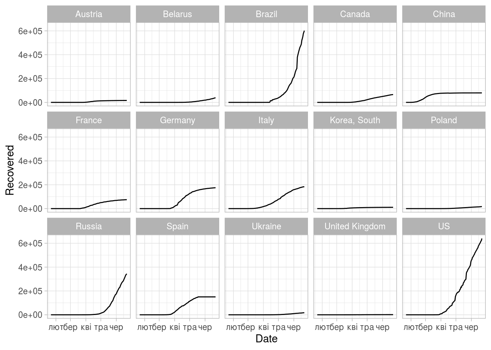
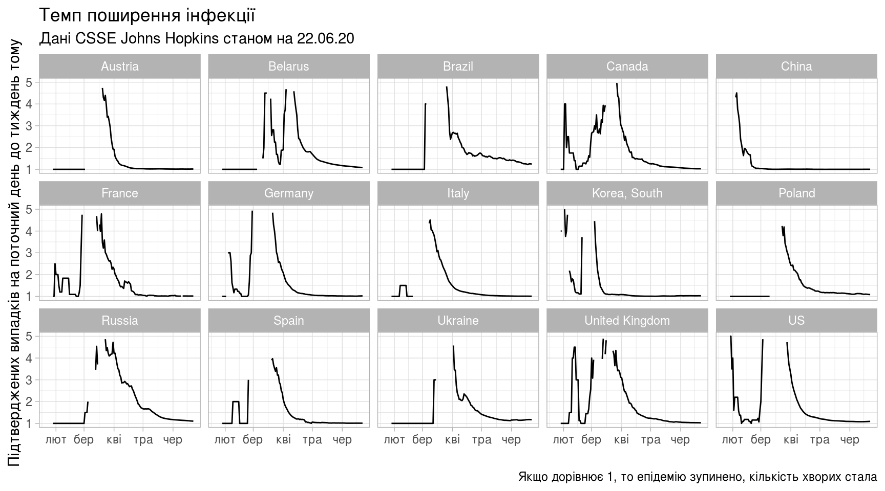
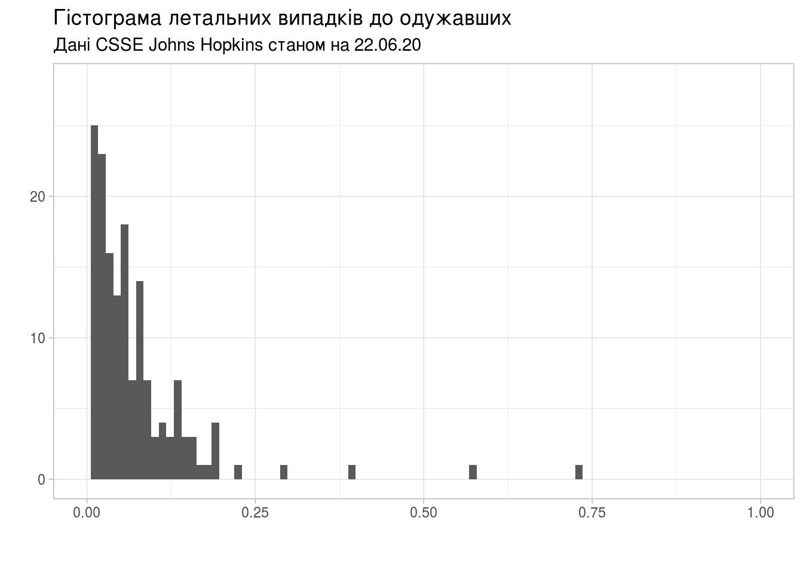
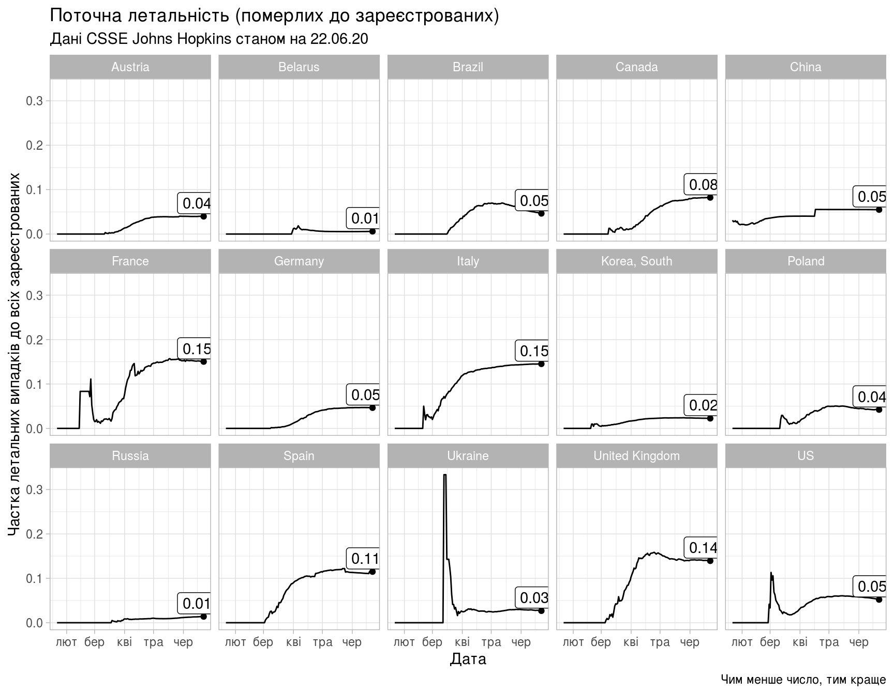

Як зчитувати та обробляти дані, оприлюднені інститутом Джонса Хопкінза
================

(в роботі): Як зчитувати та обробляти в R дані, оприлюднені інститутом Джонса Хопкінза: `csse_covid_19_data`

``` r
library(tidyverse)
```

Часові ряди CSSE
================

Часові ряди зібрані центром CSSE інституту Johns Hopkins знаходяться у вільному доступі в репозиторії на GitHub: [`csse_covid_19_time_series`](https://github.com/CSSEGISandData/COVID-19/tree/master/csse_covid_19_data/csse_covid_19_time_series). Нас цікавитимуть три часових ряда, які містять сумарні показники на певну дату:

-   `time_series_covid19_confirmed_global.csv`: кількість підтверджених випадків захворювання на коронавірус,
-   `time_series_covid19_deaths_global.csv`: кількість померлих,
-   `time_series_covid19_recovered_global.csv`: скільки одужало.

Зчитування даних
----------------

Всі три файла мають подібну структуру, особливістю якої є те, що для окремих країн показники розбито за регіонами, а дата, коли показник зареєстровано, вказана в назві стовпчика.

Така структура даних не дуже добре підходить для зручної обробки в пакеті `tidyverse` системи R. [Бажано, аби](https://r4ds.had.co.nz/tidy-data.html#tidy-data-1):

1.  Кожна змінна мала власний стовпчик.
2.  Кожне вимірювання — власний рядок.
3.  Кожне значення — власну комірку.

Тобто, бажано отримати дані, представлені як таблиця зі стовпчиками:

-   Країна,
-   Дата,
-   Кількість підтверджених випадків,
-   -//- летальних,
-   -//- одужало.

Хоча стовпчик «Дата» может бути не завжди потрібен.

Зчитування даних про кількість підтверджених випадків.

``` r
confirmed_global_csv <- read_csv('../../COVID-19/csse_covid_19_data/csse_covid_19_time_series/time_series_covid19_confirmed_global.csv')
```

    ## Parsed with column specification:
    ## cols(
    ##   .default = col_double(),
    ##   `Province/State` = col_character(),
    ##   `Country/Region` = col_character()
    ## )

    ## See spec(...) for full column specifications.

``` r
confirmed_global <- confirmed_global_csv %>%
    pivot_longer(cols=contains("/20"), names_to="Date", values_to="Confirmed") %>%
    mutate(Date=as.Date(Date,format='%m/%d/%Y'))

confirmed_global_sum <- confirmed_global %>%
    select(Country = `Country/Region`, Confirmed, Date) %>%
    group_by(Country, Date) %>%
    summarise(Confirmed = sum(Confirmed))

head(confirmed_global_sum)
```

    ## # A tibble: 6 x 3
    ## # Groups:   Country [1]
    ##   Country     Date       Confirmed
    ##   <chr>       <date>         <dbl>
    ## 1 Afghanistan 20-01-22           0
    ## 2 Afghanistan 20-01-23           0
    ## 3 Afghanistan 20-01-24           0
    ## 4 Afghanistan 20-01-25           0
    ## 5 Afghanistan 20-01-26           0
    ## 6 Afghanistan 20-01-27           0

``` r
length(confirmed_global_sum$Confirmed)
```

    ## [1] 28764

Зчитування даних про кількість летальних випадків.

``` r
deaths_global_csv <- read_csv('../../COVID-19/csse_covid_19_data/csse_covid_19_time_series/time_series_covid19_deaths_global.csv')
```

    ## Parsed with column specification:
    ## cols(
    ##   .default = col_double(),
    ##   `Province/State` = col_character(),
    ##   `Country/Region` = col_character()
    ## )

    ## See spec(...) for full column specifications.

``` r
deaths_global <- deaths_global_csv %>%
    pivot_longer(cols=contains("/20"), names_to="Date", values_to="Deaths") %>%
    mutate(Date=as.Date(Date,format='%m/%d/%Y'))

deaths_global_sum <- deaths_global %>%
    select(Country = `Country/Region`, Deaths, Date) %>%
    group_by(Country, Date) %>%
    summarise(Deaths = sum(Deaths))
```

Зчитування даних про кількість тих, хто одужав.

``` r
recovered_global_csv <- read_csv('../../COVID-19/csse_covid_19_data/csse_covid_19_time_series/time_series_covid19_recovered_global.csv')
```

    ## Parsed with column specification:
    ## cols(
    ##   .default = col_double(),
    ##   `Province/State` = col_character(),
    ##   `Country/Region` = col_character()
    ## )

    ## See spec(...) for full column specifications.

``` r
recovered_global <- recovered_global_csv %>%
    pivot_longer(cols=contains("/20"), names_to="Date", values_to="Recovered") %>%
    mutate(Date=as.Date(Date,format='%m/%d/%Y'))

recovered_global_sum <- recovered_global %>%
    select(Country = `Country/Region`, Recovered, Date) %>%
    group_by(Country, Date) %>%
    summarise(Recovered = sum(Recovered))
```

Об'єднаємо три набори даних в один:

``` r
all_sum_raw <- deaths_global_sum %>%
    full_join(confirmed_global_sum, by=c('Country', 'Date')) %>%
    full_join(recovered_global_sum, by=c('Country', 'Date'))

head(all_sum_raw)
```

    ## # A tibble: 6 x 5
    ## # Groups:   Country [1]
    ##   Country     Date       Deaths Confirmed Recovered
    ##   <chr>       <date>      <dbl>     <dbl>     <dbl>
    ## 1 Afghanistan 20-01-22        0         0         0
    ## 2 Afghanistan 20-01-23        0         0         0
    ## 3 Afghanistan 20-01-24        0         0         0
    ## 4 Afghanistan 20-01-25        0         0         0
    ## 5 Afghanistan 20-01-26        0         0         0
    ## 6 Afghanistan 20-01-27        0         0         0

``` r
length(all_sum_raw$Country)
```

    ## [1] 28764

Обчислимо співвідношення:

``` r
all_stat <- all_sum_raw %>%
    mutate(Deaths_To_Recovered = if_else(Recovered > 0,
                                         Deaths / Recovered,
                                         0),
           Deaths_To_Confirmed = if_else(Confirmed > 0,
                                         Deaths / Confirmed,
                                         0),
           Recovered_To_Confirmed = Recovered / Confirmed,
           Recovered_To_Deaths = if_else(Deaths > 0,
                                         Recovered / Deaths,
                                         0),
           Active_To_Confirmed = (
               (Confirmed - Deaths - Recovered)
               / Confirmed)) %>%
    ungroup() %>%
    mutate(Country = factor(Country))

str(all_stat)
```

    ## tibble [28,764 × 10] (S3: tbl_df/tbl/data.frame)
    ##  $ Country               : Factor w/ 188 levels "Afghanistan",..: 1 1 1 1 1 1 1 1 1 1 ...
    ##  $ Date                  : Date[1:28764], format: "20-01-22" "20-01-23" ...
    ##  $ Deaths                : num [1:28764] 0 0 0 0 0 0 0 0 0 0 ...
    ##  $ Confirmed             : num [1:28764] 0 0 0 0 0 0 0 0 0 0 ...
    ##  $ Recovered             : num [1:28764] 0 0 0 0 0 0 0 0 0 0 ...
    ##  $ Deaths_To_Recovered   : num [1:28764] 0 0 0 0 0 0 0 0 0 0 ...
    ##  $ Deaths_To_Confirmed   : num [1:28764] 0 0 0 0 0 0 0 0 0 0 ...
    ##  $ Recovered_To_Confirmed: num [1:28764] NaN NaN NaN NaN NaN NaN NaN NaN NaN NaN ...
    ##  $ Recovered_To_Deaths   : num [1:28764] 0 0 0 0 0 0 0 0 0 0 ...
    ##  $ Active_To_Confirmed   : num [1:28764] NaN NaN NaN NaN NaN NaN NaN NaN NaN NaN ...

Останній запис в таблиці:

``` r
last_stat <- all_stat[all_stat$Date == max(all_stat$Date), ]

str(last_stat)
```

    ## tibble [188 × 10] (S3: tbl_df/tbl/data.frame)
    ##  $ Country               : Factor w/ 188 levels "Afghanistan",..: 1 2 3 4 5 6 7 8 9 10 ...
    ##  $ Date                  : Date[1:188], format: "20-06-22" "20-06-22" ...
    ##  $ Deaths                : num [1:188] 598 44 852 52 10 ...
    ##  $ Confirmed             : num [1:188] 29157 1995 11920 855 186 ...
    ##  $ Recovered             : num [1:188] 8841 1159 8559 796 77 ...
    ##  $ Deaths_To_Recovered   : num [1:188] 0.0676 0.038 0.0995 0.0653 0.1299 ...
    ##  $ Deaths_To_Confirmed   : num [1:188] 0.0205 0.0221 0.0715 0.0608 0.0538 ...
    ##  $ Recovered_To_Confirmed: num [1:188] 0.303 0.581 0.718 0.931 0.414 ...
    ##  $ Recovered_To_Deaths   : num [1:188] 14.8 26.3 10 15.3 7.7 ...
    ##  $ Active_To_Confirmed   : num [1:188] 0.67627 0.39699 0.21049 0.00819 0.53226 ...

Створимо спільний підпис для всіх графіків, в якому буде вказано джерело даних та дату останнього звіту:

``` r
last_report_date <- strftime(last_stat$Date[1], format="%x")

subtitle <- paste("Дані CSSE Johns Hopkins станом на", last_report_date)
subtitle
```

    ## [1] "Дані CSSE Johns Hopkins станом на 22.06.20"

``` r
ua <- last_stat[last_stat$Country == 'Ukraine',]
be <- last_stat[last_stat$Country == 'Belarus',]
us <- last_stat[last_stat$Country == 'US',]

ua
```

    ## # A tibble: 1 x 10
    ##   Country Date       Deaths Confirmed Recovered Deaths_To_Recov…
    ##   <fct>   <date>      <dbl>     <dbl>     <dbl>            <dbl>
    ## 1 Ukraine 20-06-22     1022     38056     17211           0.0594
    ## # … with 4 more variables: Deaths_To_Confirmed <dbl>,
    ## #   Recovered_To_Confirmed <dbl>, Recovered_To_Deaths <dbl>,
    ## #   Active_To_Confirmed <dbl>

``` r
ua$Deaths_To_Recovered
```

    ## [1] 0.05938063

``` r
summary(last_stat$Deaths_To_Recovered)
```

    ##     Min.  1st Qu.   Median     Mean  3rd Qu.     Max. 
    ##  0.00000  0.01456  0.03990  0.42685  0.07997 32.84409

``` r
summary(last_stat$Active_To_Confirmed)
```

    ##    Min. 1st Qu.  Median    Mean 3rd Qu.    Max. 
    ## 0.00000 0.07614 0.30824 0.34114 0.54768 0.97851

``` r
#all_stat[last_stat$Recovered_To_Deaths > be$Recovered_To_Deaths,]
```

Загальна динаміка
-----------------

``` r
breaks_country <- c("Ukraine", "Belarus", "Poland", "Germany", "France",
                    "US", "Korea, South", "Russia", "United Kingdom",
                    "Austria", "Canada", "China", "Italy", "Spain",
                    "Brazil")

labels_country <- c("Україна", "Білорусь", "Польща", "Німеччина", "Франція",
                    "США", "Корея", "Росія", "Велика Британія",
                    "Австрія", "Канада", "КНР", "Італія", "Іспанія",
                    "Бразилія")
```

Виокримо лише перелічені вище країни із загального масиву інформації:

``` r
some_stat <- all_stat[all_stat$Country %in% factor(breaks_country),]
some_last_stat <- last_stat[last_stat$Country %in% factor(breaks_country),]
```

``` r
(ggplot(some_stat)
    + geom_line(aes(x=Date,y=Confirmed))
    + facet_wrap(vars(Country), ncol = 5)
    + theme_light())
```


``` r
(ggplot(some_stat)
    + geom_line(aes(x=Date,y=Recovered))
    + facet_wrap(vars(Country), ncol = 5)
    + theme_light())
```



``` r
(ggplot(some_stat)
    + geom_line(aes(x=Date,y=Deaths))
    + facet_wrap(vars(Country), ncol = 5)
    + theme_light())
```


``` r
(ggplot(some_stat)
    + geom_line(aes(x=Date,y=Confirmed - Deaths - Recovered))
    + facet_wrap(vars(Country), ncol = 5)
    + theme_light())
```


Обчислимо співвідношення підтверджених випадків на певну дату до показника тиждень тому (темп поширення інфекції) todo

``` r
some_stat <- some_stat %>%
    group_by(Country,Date) %>%
    mutate()

confirmed_lag <- some_stat %>%
    select(Date, Country, Confirmed) %>%
    group_by(Country) %>%
    mutate(Confirmed_Lag = lag(Confirmed, n=7, order_by=Date))

confirmed_rate <- confirmed_lag %>%
    group_by(Country) %>%
    mutate(Confirmed_Rate = if_else(Confirmed_Lag > 0,
                                    Confirmed / Confirmed_Lag,
                                    1))
```

``` r
(ggplot(confirmed_rate)
    + geom_line(aes(x=Date,y=Confirmed_Rate))
    + facet_wrap(vars(Country), ncol = 5)
    + ylim(c(1,5))
    + theme_light()
    + labs(title="Темп поширення інфекції",
           subtitle=subtitle,
           caption="Якщо дорівнює 1, то епідемію зупинено, кількість хворих стала",
           y="Підтверджених випадків на поточний день до тиждень тому",
           x=""))
```

    ## Warning: Removed 7 row(s) containing missing values (geom_path).



Скільки одужало на одного померлого
-----------------------------------

Скільки одужало на одного померлого (чим більше, тим краще), загальна статистика для всіх країн:

``` r
summary(last_stat$Recovered_To_Deaths)
```

    ##     Min.  1st Qu.   Median     Mean  3rd Qu.     Max. 
    ##    0.000    7.728   17.115   43.794   44.797 1368.846

Та поточний показник для України:

``` r
ua$Recovered_To_Deaths
```

    ## [1] 16.84051

«Рейтинг»

``` r
(ggplot(last_stat,
        aes(fct_reorder(Country, desc(Recovered_To_Deaths)),
            Recovered_To_Deaths))
    + geom_point(size=1)
    + scale_x_discrete(breaks=breaks_country, labels=labels_country)
    + ylim(c(0,100))
    + coord_flip()
    + theme_light()
    + theme(
          panel.grid.major.x = element_blank(),
          panel.border = element_blank(),
          axis.ticks.x = element_blank(),
          axis.ticks.y = element_blank())
    + labs(title="Скільки одужало на одного померлого",
           subtitle=subtitle,
           caption="Чим більше число, тим краще",
           x="",
           y=""))
```

    ## Warning: Removed 15 rows containing missing values (geom_point).


``` r
last_stat[last_stat$Deaths_To_Recovered > 1,]
```

    ## # A tibble: 3 x 10
    ##   Country Date       Deaths Confirmed Recovered Deaths_To_Recov…
    ##   <fct>   <date>      <dbl>     <dbl>     <dbl>            <dbl>
    ## 1 Haiti   20-06-22       88      5211        24             3.67
    ## 2 Nether… 20-06-22     6109     49866       186            32.8 
    ## 3 United… 20-06-22    42731    306761      1322            32.3 
    ## # … with 4 more variables: Deaths_To_Confirmed <dbl>,
    ## #   Recovered_To_Confirmed <dbl>, Recovered_To_Deaths <dbl>,
    ## #   Active_To_Confirmed <dbl>

``` r
last_stat[last_stat$Deaths_To_Recovered > 33,]
```

    ## # A tibble: 0 x 10
    ## # … with 10 variables: Country <fct>, Date <date>, Deaths <dbl>,
    ## #   Confirmed <dbl>, Recovered <dbl>, Deaths_To_Recovered <dbl>,
    ## #   Deaths_To_Confirmed <dbl>, Recovered_To_Confirmed <dbl>,
    ## #   Recovered_To_Deaths <dbl>, Active_To_Confirmed <dbl>

``` r
last_stat[last_stat$Deaths_To_Recovered < ua$Deaths_To_Recovered,]
```

    ## # A tibble: 117 x 10
    ##    Country Date       Deaths Confirmed Recovered Deaths_To_Recov…
    ##    <fct>   <date>      <dbl>     <dbl>     <dbl>            <dbl>
    ##  1 Albania 20-06-22       44      1995      1159          0.0380 
    ##  2 Armenia 20-06-22      360     20588      9131          0.0394 
    ##  3 Austra… 20-06-22      102      7492      6915          0.0148 
    ##  4 Austria 20-06-22      690     17380     16241          0.0425 
    ##  5 Azerba… 20-06-22      161     13207      7168          0.0225 
    ##  6 Bahrain 20-06-22       65     22407     16862          0.00385
    ##  7 Bangla… 20-06-22     1502    115786     46755          0.0321 
    ##  8 Belarus 20-06-22      351     59023     37923          0.00926
    ##  9 Benin   20-06-22       13       807       253          0.0514 
    ## 10 Bhutan  20-06-22        0        68        32          0      
    ## # … with 107 more rows, and 4 more variables: Deaths_To_Confirmed <dbl>,
    ## #   Recovered_To_Confirmed <dbl>, Recovered_To_Deaths <dbl>,
    ## #   Active_To_Confirmed <dbl>

Побудуємо гістограму співвідношень кількості загиблих до тих, хто одужав (чим менше значення, тим краще):

``` r
(ggplot(last_stat, aes(Deaths_To_Recovered))
    + geom_histogram(bins=90)
    + xlim(c(0,1))
    + labs(title="Гістограма летальних випадків до одужавших",
           subtitle=subtitle,
           caption="",
           x="",
           y="")
    + theme_light())
```

    ## Warning: Removed 3 rows containing non-finite values (stat_bin).

    ## Warning: Removed 2 rows containing missing values (geom_bar).



Поточна летальність, або співвідношення кількості летальних випадків до кількості зареєстрованих (чим менше значення, тим краще):

Поточна летальність для України становить:

``` r
ua$Deaths_To_Confirmed
```

    ## [1] 0.02685516

Статистичні моменти для всіх країн:

``` r
summary(last_stat$Deaths_To_Confirmed)
```

    ##     Min.  1st Qu.   Median     Mean  3rd Qu.     Max. 
    ## 0.000000 0.009285 0.021666 0.034058 0.045938 0.265770

Гістограма

``` r
(ggplot(last_stat, aes(Deaths_To_Confirmed))
    + geom_histogram(bins=90)
    + xlim(c(0,1))
    + labs(title="Гістограма поточної летальності (померлих до зареєстрованих)",
           subtitle=subtitle,
           caption="",
           x="Співвідношення летальних випадків до підтверджених",
           y="")
    + theme_light())
```

    ## Warning: Removed 2 rows containing missing values (geom_bar).


«Рейтинг»

``` r
(ggplot(last_stat,
        aes(fct_reorder(Country, desc(Deaths_To_Confirmed)),
            Deaths_To_Confirmed))
    + geom_point(size=1)
    + scale_x_discrete(breaks=breaks_country,
                       labels=labels_country)
    + coord_flip()
    + theme_light()
    + theme(
          panel.grid.major.x = element_blank(),
          panel.border = element_blank(),
          axis.ticks.x = element_blank(),
          axis.ticks.y = element_blank())
    + labs(title="Поточна летальність (померлих до зареєстрованих)",
           subtitle=subtitle,
           caption="Чим менше число, тим краще",
           x="",
           y=""))
```


``` r
(ggplot(some_stat)
    + geom_line(aes(x=Date,y=Deaths_To_Confirmed))
    + geom_point(data=some_last_stat,
                 aes(x=Date,y=Deaths_To_Confirmed))
    + geom_label(data=some_last_stat,
                 aes(x=Date-7,y=Deaths_To_Confirmed+0.03,
                     label=sprintf("%.2f",Deaths_To_Confirmed)))
    + theme_light()
    + facet_wrap(vars(Country), ncol = 5)
    + labs(title="Поточна летальність (померлих до зареєстрованих)",
           subtitle=subtitle,
           caption="Чим менше число, тим краще",
           x="Дата",
           y="Частка летальних випадків до всіх зареєстрованих"))
```



Середнє значення поточної летальності для всіх країн:

``` r
mean(last_stat$Deaths_To_Confirmed)
```

    ## [1] 0.03405818

Та глобальне:

``` r
sum(last_stat$Deaths)/sum(last_stat$Confirmed)
```

    ## [1] 0.05189466

[Повернутись на головну](index.html) або [повідомити про помилку](https://github.com/vityok/covid19_ua/issues)
