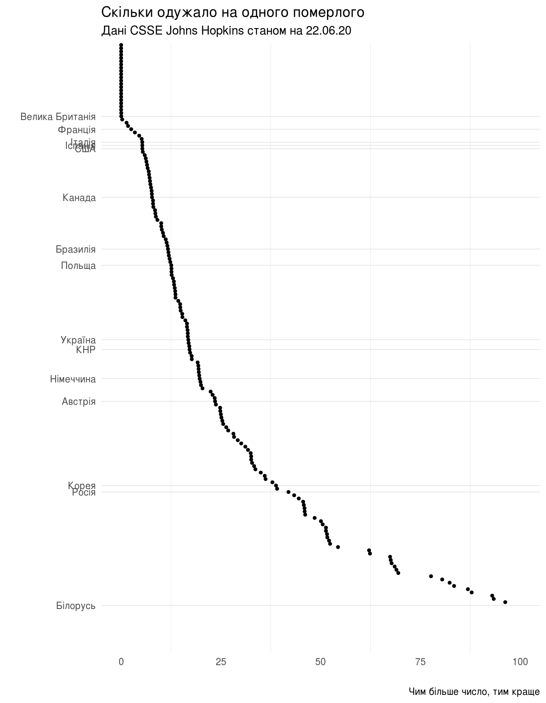

Як зчитувати та обробляти дані, оприлюднені інститутом Джонса Хопкінза
================

(в роботі): Як зчитувати та обробляти в R дані, оприлюднені інститутом Джонса Хопкінза: `csse_covid_19_data`

``` r
library(tidyverse)
```

Часові ряди CSSE
================

Часові ряди зібрані центром CSSE інституту Johns Hopkins знаходяться у вільному доступі в репозиторії на GitHub: [`csse_covid_19_time_series`](https://github.com/CSSEGISandData/COVID-19/tree/master/csse_covid_19_data/csse_covid_19_time_series). Нас цікавитимуть три часових ряда, які містять сумарні показники на певну дату:

-   `time_series_covid19_confirmed_global.csv`: кількість підтверджених випадків захворювання на коронавірус,
-   `time_series_covid19_deaths_global.csv`: кількість померлих,
-   `time_series_covid19_recovered_global.csv`: скільки одужало.

Зчитування даних
----------------

Всі три файла мають подібну структуру, особливістю якої є те, що для окремих країн показники розбито за регіонами, а дата, коли показник зареєстровано, вказана в назві стовпчика.

Така структура даних не дуже добре підходить для зручної обробки в пакеті `tidyverse` системи R. [Бажано, аби](https://r4ds.had.co.nz/tidy-data.html#tidy-data-1):

1.  Кожна змінна мала власний стовпчик.
2.  Кожне вимірювання — власний рядок.
3.  Кожне значення — власну комірку.

Тобто, бажано отримати дані, представлені як таблиця зі стовпчиками:

-   Країна,
-   Дата,
-   Кількість підтверджених випадків,
-   -//- летальних,
-   -//- одужало.

Хоча стовпчик «Дата» может бути не завжди потрібен.

Зчитати дані про кількість підтверджених випадків можна або з копії репозиторію на локальній файловій системі:

``` r
confirmed_global_csv <- read_csv('../../COVID-19/csse_covid_19_data/csse_covid_19_time_series/time_series_covid19_confirmed_global.csv')
```

    ## Parsed with column specification:
    ## cols(
    ##   .default = col_double(),
    ##   `Province/State` = col_character(),
    ##   `Country/Region` = col_character()
    ## )

    ## See spec(...) for full column specifications.

Або ж безпосередньо з серверу GitHub завантажити найсвіжішу версію:

``` r
confirmed_global_csv <- read_csv('https://raw.github.com/CSSEGISandData/COVID-19/master/csse_covid_19_data/csse_covid_19_time_series/time_series_covid19_confirmed_global.csv')
```

    ## Parsed with column specification:
    ## cols(
    ##   .default = col_double(),
    ##   `Province/State` = col_character(),
    ##   `Country/Region` = col_character()
    ## )

    ## See spec(...) for full column specifications.

Починаємо перетворення структури таблиці:

``` r
confirmed_global <- confirmed_global_csv %>%
    pivot_longer(cols=contains("/20"), names_to="Date", values_to="Confirmed") %>%
    mutate(Date=as.Date(Date,format='%m/%d/%y'))

confirmed_global_sum <- confirmed_global %>%
    select(Country = `Country/Region`, Confirmed, Date) %>%
    group_by(Country, Date) %>%
    summarise(Confirmed = sum(Confirmed))
```

    ## `summarise()` regrouping output by 'Country' (override with `.groups` argument)

Зчитування даних про кількість летальних випадків.

``` r
## deaths_global_csv <- read_csv('../../COVID-19/csse_covid_19_data/csse_covid_19_time_series/time_series_covid19_deaths_global.csv')

deaths_global_csv <- read_csv('https://raw.github.com/CSSEGISandData/COVID-19/master/csse_covid_19_data/csse_covid_19_time_series/time_series_covid19_deaths_global.csv')
```

    ## Parsed with column specification:
    ## cols(
    ##   .default = col_double(),
    ##   `Province/State` = col_character(),
    ##   `Country/Region` = col_character()
    ## )

    ## See spec(...) for full column specifications.

``` r
deaths_global <- deaths_global_csv %>%
    pivot_longer(cols=contains("/20"), names_to="Date", values_to="Deaths") %>%
    mutate(Date=as.Date(Date,format='%m/%d/%y'))

deaths_global_sum <- deaths_global %>%
    select(Country = `Country/Region`, Deaths, Date) %>%
    group_by(Country, Date) %>%
    summarise(Deaths = sum(Deaths))
```

    ## `summarise()` regrouping output by 'Country' (override with `.groups` argument)

Зчитування даних про кількість тих, хто одужав.

``` r
## recovered_global_csv <- read_csv('../../COVID-19/csse_covid_19_data/csse_covid_19_time_series/time_series_covid19_recovered_global.csv')

recovered_global_csv <- read_csv('https://raw.github.com/CSSEGISandData/COVID-19/master/csse_covid_19_data/csse_covid_19_time_series/time_series_covid19_recovered_global.csv')
```

    ## Parsed with column specification:
    ## cols(
    ##   .default = col_double(),
    ##   `Province/State` = col_character(),
    ##   `Country/Region` = col_character()
    ## )

    ## See spec(...) for full column specifications.

``` r
recovered_global <- recovered_global_csv %>%
    pivot_longer(cols=contains("/20"), names_to="Date", values_to="Recovered") %>%
    mutate(Date=as.Date(Date,format='%m/%d/%y'))

recovered_global_sum <- recovered_global %>%
    select(Country = `Country/Region`, Recovered, Date) %>%
    group_by(Country, Date) %>%
    summarise(Recovered = sum(Recovered))
```

    ## `summarise()` regrouping output by 'Country' (override with `.groups` argument)

Об'єднаємо три набори даних в один:

``` r
all_sum_raw <- deaths_global_sum %>%
    full_join(confirmed_global_sum, by=c('Country', 'Date')) %>%
    full_join(recovered_global_sum, by=c('Country', 'Date'))
```

Обчислимо співвідношення:

``` r
all_stat <- all_sum_raw %>%
    mutate(Deaths_To_Recovered = if_else(Recovered > 0,
                                         Deaths / Recovered,
                                         0),
           Deaths_To_Confirmed = if_else(Confirmed > 0,
                                         Deaths / Confirmed,
                                         0),
           Recovered_To_Confirmed = Recovered / Confirmed,
           Recovered_To_Deaths = if_else(Deaths > 0,
                                         Recovered / Deaths,
                                         0),
           Active_To_Confirmed = (
               (Confirmed - Deaths - Recovered)
               / Confirmed)) %>%
    ungroup() %>%
    mutate(Country = factor(Country))
```

Обчислюємо максимальну дату та знаходимо найсвіжіші дані:

``` r
last_stat <- all_stat[all_stat$Date == max(all_stat$Date), ]
last_report_date <- strftime(last_stat$Date[1], format="%x")
```

Дата найсвіжіших записів в таблиці: 09.11.20.

Створимо спільний підпис для всіх графіків, в якому буде вказано джерело даних та дату останнього звіту:

``` r
subtitle <- paste("Дані CSSE Johns Hopkins станом на", last_report_date)
```

Знайдемо дані для окремих країн:

``` r
ua <- last_stat[last_stat$Country == 'Ukraine',]
be <- last_stat[last_stat$Country == 'Belarus',]
us <- last_stat[last_stat$Country == 'US',]

ua
```

    ## # A tibble: 1 x 10
    ##   Country Date       Deaths Confirmed Recovered Deaths_To_Recov…
    ##   <fct>   <date>      <dbl>     <dbl>     <dbl>            <dbl>
    ## 1 Ukraine 2020-11-09   8812    483153    217716           0.0405
    ## # … with 4 more variables: Deaths_To_Confirmed <dbl>,
    ## #   Recovered_To_Confirmed <dbl>, Recovered_To_Deaths <dbl>,
    ## #   Active_To_Confirmed <dbl>

``` r
ua$Deaths_To_Recovered
```

    ## [1] 0.04047475

``` r
summary(last_stat$Deaths_To_Recovered)
```

    ##     Min.  1st Qu.   Median     Mean  3rd Qu.     Max. 
    ##  0.00000  0.01164  0.02198  0.12883  0.03795 16.45397

``` r
summary(last_stat$Active_To_Confirmed)
```

    ##    Min. 1st Qu.  Median    Mean 3rd Qu.    Max. 
    ## 0.00000 0.04637 0.14135 0.24708 0.38034 1.00000

``` r
#all_stat[last_stat$Recovered_To_Deaths > be$Recovered_To_Deaths,]
```

Загальна динаміка
-----------------

``` r
breaks_country <- c("Ukraine", "Belarus", "Poland", "Germany", "France",
                    "US", "Korea, South", "Russia", "United Kingdom",
                    "Austria", "Canada", "China", "Italy", "Spain",
                    "Brazil")

labels_country <- c("Україна", "Білорусь", "Польща", "Німеччина", "Франція",
                    "США", "Корея", "Росія", "Велика Британія",
                    "Австрія", "Канада", "КНР", "Італія", "Іспанія",
                    "Бразилія")
```

Виокримо лише перелічені вище країни із загального масиву інформації:

``` r
some_stat <- all_stat[all_stat$Country %in% factor(breaks_country),]
some_last_stat <- last_stat[last_stat$Country %in% factor(breaks_country),]
```

``` r
(ggplot(some_stat)
    + geom_line(aes(x=Date,y=Confirmed))
    + facet_wrap(vars(Country), ncol = 5)
    + theme_light())
```


``` r
(ggplot(some_stat)
    + geom_line(aes(x=Date,y=Recovered))
    + facet_wrap(vars(Country), ncol = 5)
    + theme_light())
```


``` r
(ggplot(some_stat)
    + geom_line(aes(x=Date,y=Deaths))
    + facet_wrap(vars(Country), ncol = 5)
    + theme_light())
```


``` r
(ggplot(some_stat)
    + geom_line(aes(x=Date,y=Confirmed - Deaths - Recovered))
    + facet_wrap(vars(Country), ncol = 5)
    + theme_light())
```


TODO: це не темп поширення інфекції, треба переробити на легший для розуміння показник (наприклад, скільки нових випадків виявлено в порівнянні з тижнем тому)

Обчислимо співвідношення нових підтверджених випадків на певну дату до показника тиждень тому (темп поширення інфекції). Слід зробити наголос на тому, що цей показник обчислений не за «науковим» методом, може бути корисним лише як ілюстрація темпів поширення вірусу.

Слід також зазначити, що показник поточного коефіцієнту відтворення \[R_t\] використовують для дослідження епідемій, але із [деякими застереженнями](https://www.nature.com/articles/d41586-020-02009-w).

``` r
some_stat <- some_stat %>%
    group_by(Country,Date) %>%
    mutate()

confirmed_lag <- some_stat %>%
    select(Date, Country, Confirmed) %>%
    group_by(Country) %>%
    mutate(Confirmed_New = Confirmed - lag(Confirmed, n=1, order_by=Date)) %>%
    mutate(Confirmed_New_Lag7 = lag(Confirmed_New, n=7, order_by=Date))

confirmed_rate <- confirmed_lag %>%
    group_by(Country) %>%
    mutate(Confirmed_Rate = if_else(Confirmed_New_Lag7 == 0,
                                    1,
                                    Confirmed_New / Confirmed_New_Lag7))
```

На графіку добре видно, що спершу вірус поширювався дуже швидко, коєфіцієнт \[R_t\] часто долав значення 5 та навіть більше.

``` r
(ggplot(confirmed_rate)
    + geom_point(aes(x=Date,y=Confirmed_Rate),size=0.5)
    + facet_wrap(vars(Country), ncol = 5)
    + ylim(c(0,5))
    + theme_light()
    + labs(title="Темп поширення інфекції",
           subtitle=subtitle,
           caption="Якщо менше 1, то епідемія згасає",
           y="Підтверджених випадків на поточний день до тиждень тому",
           x=""))
```

    ## Warning: Removed 314 rows containing missing values (geom_point).


Тепер побудуємо такий саме графік, але відкинемо значення до 1 травня:

``` r
confirmed_rate_may <- filter(confirmed_rate, Date > as.Date('2020-05-01'))

(ggplot(confirmed_rate_may)
    + geom_point(aes(x=Date,y=Confirmed_Rate),size=0.5)
    + facet_wrap(vars(Country), ncol = 5)
    + ylim(c(0,5))
    + theme_light()
    + labs(title="Темп поширення інфекції після 1 травня 2020 року",
           subtitle=subtitle,
           caption="Якщо менше 1, то епідемія згасає",
           y="Підтверджених випадків на поточний день до тиждень тому",
           x=""))
```

    ## Warning: Removed 56 rows containing missing values (geom_point).


Скільки одужало на одного померлого
-----------------------------------

Скільки одужало на одного померлого (чим більше, тим краще), загальна статистика для всіх країн:

``` r
summary(last_stat$Recovered_To_Deaths)
```

    ##    Min. 1st Qu.  Median    Mean 3rd Qu.    Max. 
    ##    0.00   19.36   34.49   64.63   58.38 2070.75

Та поточне значення цього показника для України: 24.7067635.

«Рейтинг»

``` r
(ggplot(last_stat,
        aes(fct_reorder(Country, desc(Recovered_To_Deaths)),
            Recovered_To_Deaths))
    + geom_point(size=1)
    + scale_x_discrete(breaks=breaks_country, labels=labels_country)
    + ylim(c(0,100))
    + coord_flip()
    + theme_light()
    + theme(
          panel.grid.major.x = element_blank(),
          panel.border = element_blank(),
          axis.ticks.x = element_blank(),
          axis.ticks.y = element_blank())
    + labs(title="Скільки одужало на одного померлого",
           subtitle=subtitle,
           caption="Чим більше число, тим краще",
           x="",
           y=""))
```

    ## Warning: Removed 24 rows containing missing values (geom_point).



``` r
last_stat[last_stat$Deaths_To_Recovered > 1,]
```

    ## # A tibble: 2 x 10
    ##   Country Date       Deaths Confirmed Recovered Deaths_To_Recov…
    ##   <fct>   <date>      <dbl>     <dbl>     <dbl>            <dbl>
    ## 1 Nether… 2020-11-09   8112    421503      6157             1.32
    ## 2 United… 2020-11-09  49329   1216747      2998            16.5 
    ## # … with 4 more variables: Deaths_To_Confirmed <dbl>,
    ## #   Recovered_To_Confirmed <dbl>, Recovered_To_Deaths <dbl>,
    ## #   Active_To_Confirmed <dbl>

``` r
last_stat[last_stat$Deaths_To_Recovered > 33,]
```

    ## # A tibble: 0 x 10
    ## # … with 10 variables: Country <fct>, Date <date>, Deaths <dbl>,
    ## #   Confirmed <dbl>, Recovered <dbl>, Deaths_To_Recovered <dbl>,
    ## #   Deaths_To_Confirmed <dbl>, Recovered_To_Confirmed <dbl>,
    ## #   Recovered_To_Deaths <dbl>, Active_To_Confirmed <dbl>

``` r
last_stat[last_stat$Deaths_To_Recovered < ua$Deaths_To_Recovered,]
```

    ## # A tibble: 146 x 10
    ##    Country Date       Deaths Confirmed Recovered Deaths_To_Recov…
    ##    <fct>   <date>      <dbl>     <dbl>     <dbl>            <dbl>
    ##  1 Andorra 2020-11-09     75      5437      4332          0.0173 
    ##  2 Antigu… 2020-11-09      3       131       122          0.0246 
    ##  3 Argent… 2020-11-09  33907   1250499   1073577          0.0316 
    ##  4 Armenia 2020-11-09   1580    107466     64910          0.0243 
    ##  5 Austra… 2020-11-09    907     27669     25454          0.0356 
    ##  6 Austria 2020-11-09   1454    158746     94627          0.0154 
    ##  7 Azerba… 2020-11-09    852     66046     49411          0.0172 
    ##  8 Bahamas 2020-11-09    154      6964      4943          0.0312 
    ##  9 Bahrain 2020-11-09    329     83632     81225          0.00405
    ## 10 Bangla… 2020-11-09   6092    421921    339768          0.0179 
    ## # … with 136 more rows, and 4 more variables: Deaths_To_Confirmed <dbl>,
    ## #   Recovered_To_Confirmed <dbl>, Recovered_To_Deaths <dbl>,
    ## #   Active_To_Confirmed <dbl>

Побудуємо гістограму співвідношень кількості загиблих до тих, хто одужав (чим менше значення, тим краще):

``` r
(ggplot(last_stat, aes(Deaths_To_Recovered))
    + geom_histogram(bins=90)
    + xlim(c(0,1))
    + labs(title="Гістограма летальних випадків до одужавших",
           subtitle=subtitle,
           caption="",
           x="",
           y="")
    + theme_light())
```

    ## Warning: Removed 2 rows containing non-finite values (stat_bin).

    ## Warning: Removed 2 rows containing missing values (geom_bar).


Поточна летальність, або співвідношення кількості летальних випадків до кількості зареєстрованих (чим менше значення, тим краще):

Поточна летальність для України становить 0.0182385.

Статистичні моменти для всіх країн:

``` r
summary(last_stat$Deaths_To_Confirmed)
```

    ##     Min.  1st Qu.   Median     Mean  3rd Qu.     Max. 
    ## 0.000000 0.009226 0.017387 0.022651 0.027054 0.292129

Гістограма

``` r
(ggplot(last_stat, aes(Deaths_To_Confirmed))
    + geom_histogram(bins=90)
    + xlim(c(0,1))
    + labs(title="Гістограма поточної летальності (померлих до зареєстрованих)",
           subtitle=subtitle,
           caption="",
           x="Співвідношення летальних випадків до підтверджених",
           y="")
    + theme_light())
```

    ## Warning: Removed 2 rows containing missing values (geom_bar).


«Рейтинг»

``` r
(ggplot(last_stat,
        aes(fct_reorder(Country, desc(Deaths_To_Confirmed)),
            Deaths_To_Confirmed))
    + geom_point(size=1)
    + scale_x_discrete(breaks=breaks_country,
                       labels=labels_country)
    + coord_flip()
    + theme_light()
    + theme(
          panel.grid.major.x = element_blank(),
          panel.border = element_blank(),
          axis.ticks.x = element_blank(),
          axis.ticks.y = element_blank())
    + labs(title="Поточна летальність (померлих до зареєстрованих)",
           subtitle=subtitle,
           caption="Чим менше число, тим краще",
           x="",
           y=""))
```


``` r
(ggplot(some_stat)
    + geom_line(aes(x=Date,y=Deaths_To_Confirmed))
    + geom_point(data=some_last_stat,
                 aes(x=Date,y=Deaths_To_Confirmed))
    + geom_label(data=some_last_stat,
                 aes(x=Date-7,y=Deaths_To_Confirmed+0.03,
                     label=sprintf("%.2f",Deaths_To_Confirmed)))
    + theme_light()
    + facet_wrap(vars(Country), ncol = 5)
    + labs(title="Поточна летальність (померлих до зареєстрованих)",
           subtitle=subtitle,
           caption="Чим менше число, тим краще",
           x="Дата",
           y="Частка летальних випадків до всіх зареєстрованих"))
```


Середнє значення поточної летальності для всіх країн: 0.0226514 та глобальне: 0.0248084.

[Повернутись на головну](index.html) або [повідомити про помилку](https://github.com/vityok/covid19_ua/issues)
