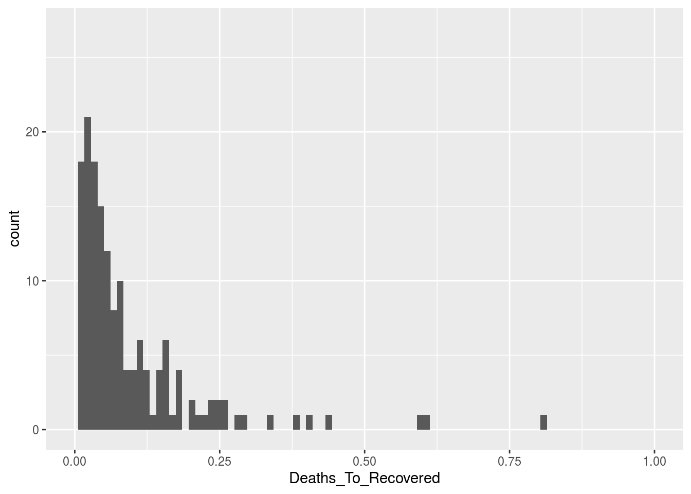

Як зчитувати та обробляти дані, оприлюднені інститутом Джонса Хопкінза
================

(в роботі): Як зчитувати та обробляти в R дані, оприлюднені інститутом Джонса Хопкінза: `csse_covid_19_data`

``` r
library(tidyverse)
```

Часові ряди CSSE
================

Часові ряди зібрані центром CSSE інституту Jhons Hopkins знаходяться у вільному доступі в репозиторії на GitHub: [`csse_covid_19_time_series`](https://github.com/CSSEGISandData/COVID-19/tree/master/csse_covid_19_data/csse_covid_19_time_series). Нас цікавитимуть три часових ряда, які містять сумарні показники на певну дату:

-   `time_series_covid19_confirmed_global.csv`: кількість підтверджених випадків захворювання на коронавірус,
-   `time_series_covid19_deaths_global.csv`: кількість померлих,
-   `time_series_covid19_recovered_global.csv`: скільки одужало.

Всі три файла мають подібну структуру, особливістю якої є те, що для окремих країн показники розбито за регіонами, а дата, коли показник зареєстровано, вказана в назві стовпчика.

Така структура даних не дуже добре підходить для зручної обробки в пакеті `tidyverse` системи R. [Бажано, аби](https://r4ds.had.co.nz/tidy-data.html#tidy-data-1):

1.  Кожна змінна мала власний стовпчик.
2.  Кожне вимірювання — власний рядок.
3.  Кожне значення — власну комірку.

Тобто, бажано отримати дані, представлені як таблиця зі стовпчиками:

-   Країна,
-   Дата,
-   Кількість випадків,
-   -//- померлих,
-   -//- одужало.

Хоча "Дата" може бути зайвою для певних варіантів використання даних.

``` r
deaths_global_csv <- read_csv('../../COVID-19/csse_covid_19_data/csse_covid_19_time_series/time_series_covid19_deaths_global.csv')
```

    ## Parsed with column specification:
    ## cols(
    ##   .default = col_double(),
    ##   `Province/State` = col_character(),
    ##   `Country/Region` = col_character()
    ## )

    ## See spec(...) for full column specifications.

``` r
deaths_global <- deaths_global_csv %>%
    pivot_longer(cols=contains("/20"), names_to="Date", values_to="Deaths") %>%
    mutate(Date=as.Date(Date,format='%m/%d/%Y'))

deaths_global_sum <- deaths_global %>%
    select(Country = `Country/Region`, Deaths, Date) %>%
    group_by(Country) %>%
    filter(Date == max(Date)) %>%
    summarise(Deaths = sum(Deaths))
```

``` r
confirmed_global_csv <- read_csv('../../COVID-19/csse_covid_19_data/csse_covid_19_time_series/time_series_covid19_confirmed_global.csv')
```

    ## Parsed with column specification:
    ## cols(
    ##   .default = col_double(),
    ##   `Province/State` = col_character(),
    ##   `Country/Region` = col_character()
    ## )

    ## See spec(...) for full column specifications.

``` r
confirmed_global <- confirmed_global_csv %>%
    pivot_longer(cols=contains("/20"), names_to="Date", values_to="Confirmed") %>%
    mutate(Date=as.Date(Date,format='%m/%d/%Y'))

confirmed_global_sum <- confirmed_global %>%
    select(Country = `Country/Region`, Confirmed, Date) %>%
    group_by(Country) %>%
    filter(Date == max(Date)) %>%
    summarise(Confirmed = sum(Confirmed))

head(confirmed_global_sum)
```

    ## # A tibble: 6 x 2
    ##   Country             Confirmed
    ##   <chr>                   <dbl>
    ## 1 Afghanistan             10582
    ## 2 Albania                   998
    ## 3 Algeria                  8306
    ## 4 Andorra                   762
    ## 5 Angola                     69
    ## 6 Antigua and Barbuda        25

``` r
length(confirmed_global_sum$Confirmed)
```

    ## [1] 188

``` r
recovered_global_csv <- read_csv('../../COVID-19/csse_covid_19_data/csse_covid_19_time_series/time_series_covid19_recovered_global.csv')
```

    ## Parsed with column specification:
    ## cols(
    ##   .default = col_double(),
    ##   `Province/State` = col_character(),
    ##   `Country/Region` = col_character()
    ## )

    ## See spec(...) for full column specifications.

``` r
recovered_global <- recovered_global_csv %>%
    pivot_longer(cols=contains("/20"), names_to="Date", values_to="Recovered") %>%
    mutate(Date=as.Date(Date,format='%m/%d/%Y'))

recovered_global_sum <- recovered_global %>%
    select(Country = `Country/Region`, Recovered, Date) %>%
    group_by(Country) %>%
    filter(Date == max(Date)) %>%
    summarise(Recovered = sum(Recovered))
```

Об'єднаємо три набори даних в один:

``` r
all_sum_raw <- deaths_global_sum %>%
    full_join(confirmed_global_sum, by='Country') %>%
    full_join(recovered_global_sum, by='Country')


head(all_sum_raw)
```

    ## # A tibble: 6 x 4
    ##   Country             Deaths Confirmed Recovered
    ##   <chr>                <dbl>     <dbl>     <dbl>
    ## 1 Afghanistan            218     10582      1075
    ## 2 Albania                 32       998       789
    ## 3 Algeria                600      8306      4784
    ## 4 Andorra                 51       762       653
    ## 5 Angola                   4        69        18
    ## 6 Antigua and Barbuda      3        25        19

``` r
length(all_sum_raw$Country)
```

    ## [1] 188

``` r
summary(all_sum_raw)
```

    ##    Country              Deaths           Confirmed           Recovered       
    ##  Length:188         Min.   :    0.00   Min.   :      2.0   Min.   :     0.0  
    ##  Class :character   1st Qu.:    5.75   1st Qu.:    275.5   1st Qu.:   118.5  
    ##  Mode  :character   Median :   32.00   Median :   1486.0   Median :   673.0  
    ##                     Mean   : 1835.42   Mean   :  28763.9   Mean   : 11534.9  
    ##                     3rd Qu.:  250.00   3rd Qu.:  10984.2   3rd Qu.:  4801.8  
    ##                     Max.   :97720.00   Max.   :1643246.0   Max.   :366736.0

Обчислимо співвідношення:

``` r
all_stat <- all_sum_raw %>%
    mutate(Deaths_To_Recovered = if_else(Recovered > 0,
                                         Deaths / Recovered,
                                         0),
           Deaths_To_Confirmed = if_else(Confirmed > 0,
                                         Deaths / Confirmed,
                                         0),
           Recovered_To_Confirmed = Recovered / Confirmed,
           Recovered_To_Deaths = if_else(Deaths > 0,
                                         Recovered / Deaths,
                                         0),
           Active_To_Confirmed = (
               (Confirmed - Deaths - Recovered)
               / Confirmed),
           Country = factor(Country))

head(all_stat)
```

    ## # A tibble: 6 x 9
    ##   Country Deaths Confirmed Recovered Deaths_To_Recov… Deaths_To_Confi…
    ##   <fct>    <dbl>     <dbl>     <dbl>            <dbl>            <dbl>
    ## 1 Afghan…    218     10582      1075           0.203            0.0206
    ## 2 Albania     32       998       789           0.0406           0.0321
    ## 3 Algeria    600      8306      4784           0.125            0.0722
    ## 4 Andorra     51       762       653           0.0781           0.0669
    ## 5 Angola       4        69        18           0.222            0.0580
    ## 6 Antigu…      3        25        19           0.158            0.12  
    ## # … with 3 more variables: Recovered_To_Confirmed <dbl>,
    ## #   Recovered_To_Deaths <dbl>, Active_To_Confirmed <dbl>

``` r
ua <- all_stat[all_stat$Country == 'Ukraine',]
be <- all_stat[all_stat$Country == 'Belarus',]

ua
```

    ## # A tibble: 1 x 9
    ##   Country Deaths Confirmed Recovered Deaths_To_Recov… Deaths_To_Confi…
    ##   <fct>    <dbl>     <dbl>     <dbl>            <dbl>            <dbl>
    ## 1 Ukraine    617     20986      7108           0.0868           0.0294
    ## # … with 3 more variables: Recovered_To_Confirmed <dbl>,
    ## #   Recovered_To_Deaths <dbl>, Active_To_Confirmed <dbl>

``` r
ua$Deaths_To_Recovered
```

    ## [1] 0.0868036

``` r
summary(all_stat$Deaths_To_Recovered)
```

    ##     Min.  1st Qu.   Median     Mean  3rd Qu.     Max. 
    ##  0.00000  0.01864  0.04864  0.47802  0.11202 33.56897

``` r
summary(all_stat$Active_To_Confirmed)
```

    ##    Min. 1st Qu.  Median    Mean 3rd Qu.    Max. 
    ##  0.0000  0.1675  0.4343  0.4247  0.6576  1.0000

``` r
all_stat[all_stat$Recovered_To_Deaths > be$Recovered_To_Deaths,]
```

    ## # A tibble: 14 x 9
    ##    Country Deaths Confirmed Recovered Deaths_To_Recov… Deaths_To_Confi…
    ##    <fct>    <dbl>     <dbl>     <dbl>            <dbl>            <dbl>
    ##  1 Bahrain     14      9138      4587          0.00305         0.00153 
    ##  2 Brunei       1       141       137          0.00730         0.00709 
    ##  3 Djibou…     10      2270      1064          0.00940         0.00441 
    ##  4 Eswati…      2       250       156          0.0128          0.008   
    ##  5 Guinea      20      3275      1673          0.0120          0.00611 
    ##  6 Iceland     10      1804      1791          0.00558         0.00554 
    ##  7 Kazakh…     35      8531      4352          0.00804         0.00410 
    ##  8 Malta        6       610       476          0.0126          0.00984 
    ##  9 Qatar       23     43714      9170          0.00251         0.000526
    ## 10 Saudi …    390     72560     43520          0.00896         0.00537 
    ## 11 Singap…     23     31616     14876          0.00155         0.000727
    ## 12 Sri La…      9      1141       674          0.0134          0.00789 
    ## 13 Uzbeki…     13      3164      2565          0.00507         0.00411 
    ## 14 West B…      3       423       357          0.00840         0.00709 
    ## # … with 3 more variables: Recovered_To_Confirmed <dbl>,
    ## #   Recovered_To_Deaths <dbl>, Active_To_Confirmed <dbl>

Скільки одужало на одного померлого (чим більше, тим краще):

``` r
summary(all_stat$Recovered_To_Deaths)
```

    ##    Min. 1st Qu.  Median    Mean 3rd Qu.    Max. 
    ##   0.000   4.823  14.301  31.012  32.493 646.783

``` r
ua$Recovered_To_Deaths
```

    ## [1] 11.52026

``` r
breaks_country <- c("Ukraine", "Belarus", "Poland", "Germany", "France",
                    "US", "Korea, South", "Russia", "United Kingdom",
                    "Austria", "Canada", "China", "Italy", "Spain")

labels_country <- c("Україна", "Білорусь", "Польща", "Німеччина", "Франція",
                    "США", "Корея", "Росія", "Велика Британія",
                    "Австрія", "Канада", "КНР", "Італія", "Іспанія")
```

«Рейтинг»

``` r
(ggplot(all_stat,
        aes(fct_reorder(Country, desc(Recovered_To_Deaths)),
            Recovered_To_Deaths))
    + geom_point(size=1)
    + scale_x_discrete(breaks=breaks_country, labels=labels_country)
    + ylim(c(0,100))
    + coord_flip()
    + theme_light()
    + theme(
          panel.grid.major.x = element_blank(),
          panel.border = element_blank(),
          axis.ticks.x = element_blank(),
          axis.ticks.y = element_blank())
    + labs(title="Скільки одужало на одного померлого",
           subtitle="Дані CSSE Jhons Hopkins",
           caption="Чим більше число, тим краще",
           x="",
           y="")
)
```

    ## Warning: Removed 10 rows containing missing values (geom_point).


``` r
all_stat[all_stat$Deaths_To_Recovered > 1,]
```

    ## # A tibble: 6 x 9
    ##   Country Deaths Confirmed Recovered Deaths_To_Recov… Deaths_To_Confi…
    ##   <fct>    <dbl>     <dbl>     <dbl>            <dbl>            <dbl>
    ## 1 Haiti       26       865        22             1.18           0.0301
    ## 2 Nether…   5841     45437       174            33.6            0.129 
    ## 3 Sao To…      8       251         4             2              0.0319
    ## 4 South …      8       655         6             1.33           0.0122
    ## 5 United…  36875    260916      1151            32.0            0.141 
    ## 6 Yemen       42       222        10             4.2            0.189 
    ## # … with 3 more variables: Recovered_To_Confirmed <dbl>,
    ## #   Recovered_To_Deaths <dbl>, Active_To_Confirmed <dbl>

``` r
all_stat[all_stat$Deaths_To_Recovered > 33,]
```

    ## # A tibble: 1 x 9
    ##   Country Deaths Confirmed Recovered Deaths_To_Recov… Deaths_To_Confi…
    ##   <fct>    <dbl>     <dbl>     <dbl>            <dbl>            <dbl>
    ## 1 Nether…   5841     45437       174             33.6            0.129
    ## # … with 3 more variables: Recovered_To_Confirmed <dbl>,
    ## #   Recovered_To_Deaths <dbl>, Active_To_Confirmed <dbl>

``` r
all_stat[all_stat$Deaths_To_Recovered < ua$Deaths_To_Recovered,]
```

    ## # A tibble: 131 x 9
    ##    Country Deaths Confirmed Recovered Deaths_To_Recov… Deaths_To_Confi…
    ##    <fct>    <dbl>     <dbl>     <dbl>            <dbl>            <dbl>
    ##  1 Albania     32       998       789          0.0406           0.0321 
    ##  2 Andorra     51       762       653          0.0781           0.0669 
    ##  3 Armenia     81      6661      3064          0.0264           0.0122 
    ##  4 Austra…    102      7114      6531          0.0156           0.0143 
    ##  5 Austria    640     16503     15063          0.0425           0.0388 
    ##  6 Azerba…     49      4122      2607          0.0188           0.0119 
    ##  7 Bahrain     14      9138      4587          0.00305          0.00153
    ##  8 Bangla…    480     33610      6901          0.0696           0.0143 
    ##  9 Belarus    199     36198     14155          0.0141           0.00550
    ## 10 Benin        3       191        82          0.0366           0.0157 
    ## # … with 121 more rows, and 3 more variables: Recovered_To_Confirmed <dbl>,
    ## #   Recovered_To_Deaths <dbl>, Active_To_Confirmed <dbl>

Побудуємо гістограму співвідношень кількості загиблих до тих, хто одужав (чим менше значення, тим краще):

``` r
ggplot(all_stat, aes(Deaths_To_Recovered)) +
    geom_histogram(bins=90) +
    xlim(c(0,1))
```

    ## Warning: Removed 6 rows containing non-finite values (stat_bin).

    ## Warning: Removed 2 rows containing missing values (geom_bar).



Поточна летальність, або співвідношення кількості летальних випадків до кількості зареєстрованих (чим менше значення, тим краще):

Поточна летальність для України становить:

``` r
ua$Deaths_To_Confirmed
```

    ## [1] 0.02940055

Статистичні моменти для всіх країн:

``` r
summary(all_stat$Deaths_To_Confirmed)
```

    ##     Min.  1st Qu.   Median     Mean  3rd Qu.     Max. 
    ## 0.000000 0.008232 0.027892 0.036117 0.048852 0.222222

Гістограма

``` r
ggplot(all_stat, aes(Deaths_To_Confirmed)) +
    geom_histogram(bins=90) +
    xlim(c(0,1))
```

    ## Warning: Removed 2 rows containing missing values (geom_bar).


«Рейтинг»

``` r
(ggplot(all_stat,
        aes(fct_reorder(Country, desc(Deaths_To_Confirmed)),
            Deaths_To_Confirmed))
    + geom_point(size=1)
    + scale_x_discrete(breaks=breaks_country,
                       labels=labels_country)
    + coord_flip()
    + theme_light()
    + theme(
          panel.grid.major.x = element_blank(),
          panel.border = element_blank(),
          axis.ticks.x = element_blank(),
          axis.ticks.y = element_blank())
    + labs(title="Летальність (померлих до зареєстрованих)",
           subtitle="Дані CSSE Jhons Hopkins",
           caption="Чим менше число, тим краще",
           x="",
           y="")
)
```


[Повернутись на головну](index.html) або [повідомити про помилку]((https://github.com/vityok/covid19_ua/issues))
