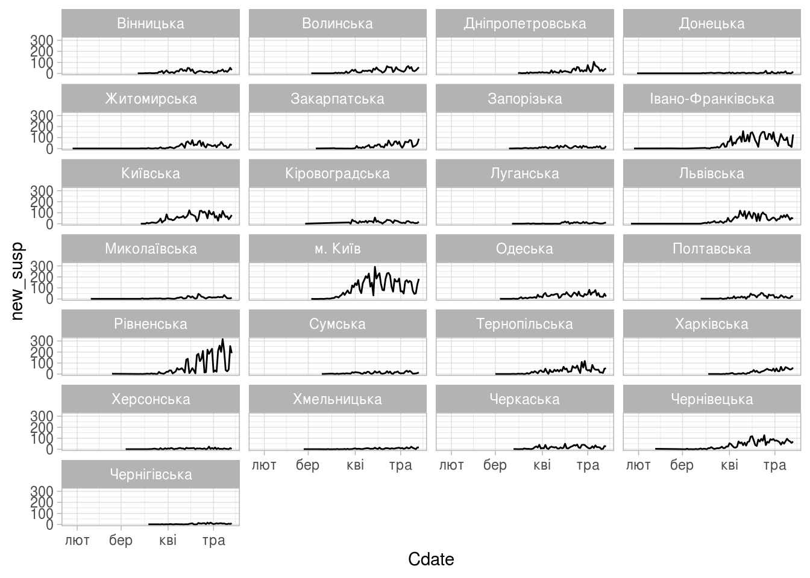

Динаміка поширення коронавірусної інфекції по областях
================

Побудуємо графіки поширення коронавірусної інфекції по областях. Для цього скористаємось бібліотеками функцій `ggplot2` для створення графіків та `tidyverse` для підготовки даних.

``` r
library(ggplot2)
library(tidyverse)
```

Якщо системні налаштування локалі не співпадають з бажаними, їх можна змінити навіть тоді, коли сеанс роботи в R розпочато, для цього знадобиться функція [`Sys.setlocale`](https://www.rdocumentation.org/packages/base/versions/3.6.2/topics/locales):

``` r
Sys.setlocale(category="LC_ALL",locale="uk_UA.utf8" )
```

    ## [1] "LC_CTYPE=uk_UA.utf8;LC_NUMERIC=C;LC_TIME=uk_UA.utf8;LC_COLLATE=uk_UA.utf8;LC_MONETARY=uk_UA.utf8;LC_MESSAGES=en_US.UTF-8;LC_PAPER=en_US.UTF-8;LC_NAME=C;LC_ADDRESS=C;LC_TELEPHONE=C;LC_MEASUREMENT=en_US.UTF-8;LC_IDENTIFICATION=C"

Тепер вже можна починати роботу. Зчитаємо дані спочатку в таблицю, а потім перетворимо її на фрейм даних для подальшої обробки.

``` r
area_dyn_csv <- read.csv('../covid19_by_area_type_hosp_dynamics.csv')
area_dyn <- as.data.frame(area_dyn_csv)
```

Таблиця в файлі `covid19_by_area_type_hosp_dynamics.csv` має доволі велику кількість стовпчиків, перелічемо їх для зручності подальшого використання в скрипті:

zvit\_date, registration\_area, priority\_hosp\_area, edrpou\_hosp, legal\_entity\_name\_hosp, legal\_entity\_lat, legal\_entity\_lng, person\_gender, person\_age\_group, add\_conditions, is\_medical\_worker, new\_susp, new\_confirm, active\_confirm, new\_death, new\_recover.

Зараз нам цікаві лише кілька:

-   `zvit_date`, дата
-   `registration_area`, назва області або місто Київ
-   `new_susp`, кількість підозр зареєстрованих протягом цього дня
-   `new_confirm`, кількість підтверджених випадків захворювання протягом дня
-   `new_death`, кількість зареєстрованих смертей протягом дня

Наступним кроком підрахуємо сумарні значення цікавих нам показників, що припадають на певний регіон протягом доби. Бібліотека `tidyverse` дає можливість зробити це функціями, що ззовні нагадують відповідні конструкції в SQL:

``` r
daily_area_reg_dyn <- area_dyn %>%
    select(zvit_date, registration_area, new_susp, new_confirm, new_death) %>%
    group_by(zvit_date, registration_area) %>%
    summarise(new_susp = sum(new_susp),
              new_confirm = sum(new_confirm),
              new_death = sum(new_death))
```

Поки що дані про дати були представлені в форматі звичайних текстових рядків. Аби система могла нормально працювати з ними, їх слід перетворити у внутрішнє представлення. [Основними](https://www.rdocumentation.org/packages/base/versions/3.6.2/topics/DateTimeClasses) класами для представлення часу та дат в R є `POSIXct` та `POSIXlt`. Однак, для зручнішої роботи з датами (календарними днями) є клас [`Date`](https://www.rdocumentation.org/packages/base/versions/3.6.2/topics/Dates). Його внутрішнє представлення --- ціле число, що дорівнює кількості днів, що минули від першого січня 1970 року до вказаної дати.

Аби перетворити рядок з текстом дати на об'єкт класу `Date` служить функція [`as.Date`](https://www.rdocumentation.org/packages/base/versions/3.6.2/topics/as.Date). Передамо як аргументи власне рядок з датою, та рядок, що описує формат, в якому цю дату записано:

``` r
daily_area_reg_dyn <- mutate(daily_area_reg_dyn, Cdate = as.Date(zvit_date, "%Y-%m-%d"))
```

Нарешті, побудуємо графік.

``` r
(ggplot(daily_area_reg_dyn, aes(x=Cdate, y=new_susp))
    + geom_line()
    + facet_wrap(vars(registration_area), ncol = 4)
    + theme_light())
```


