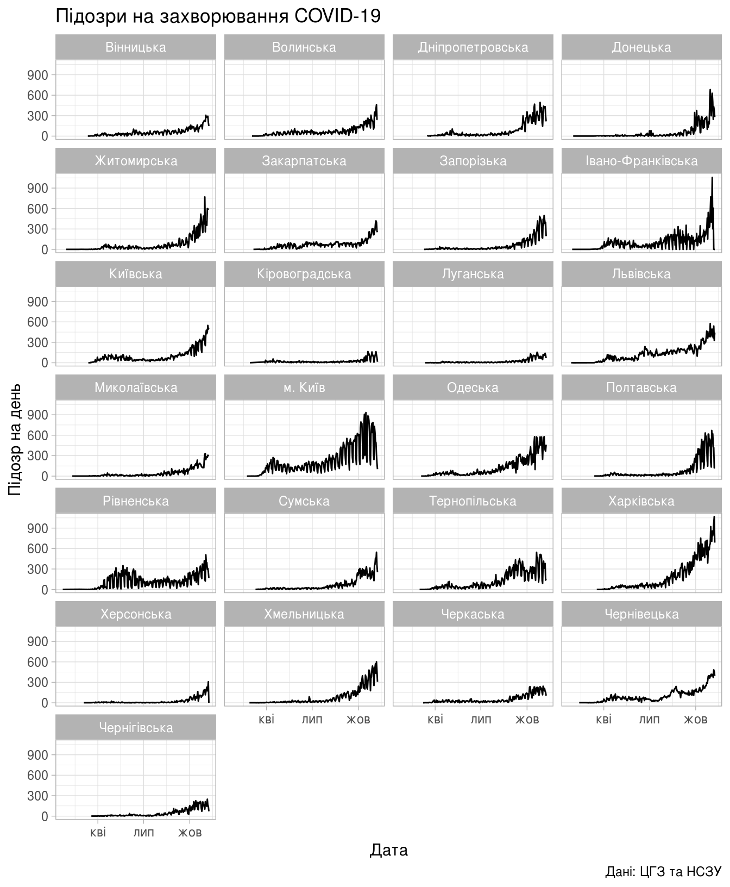
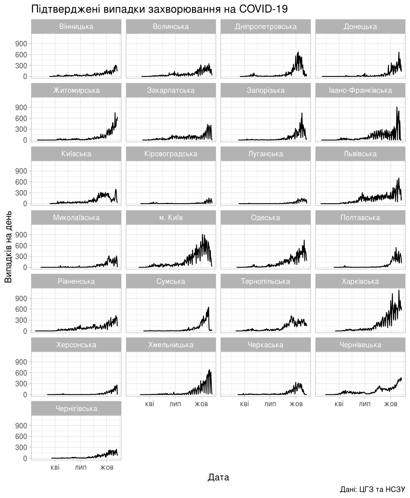
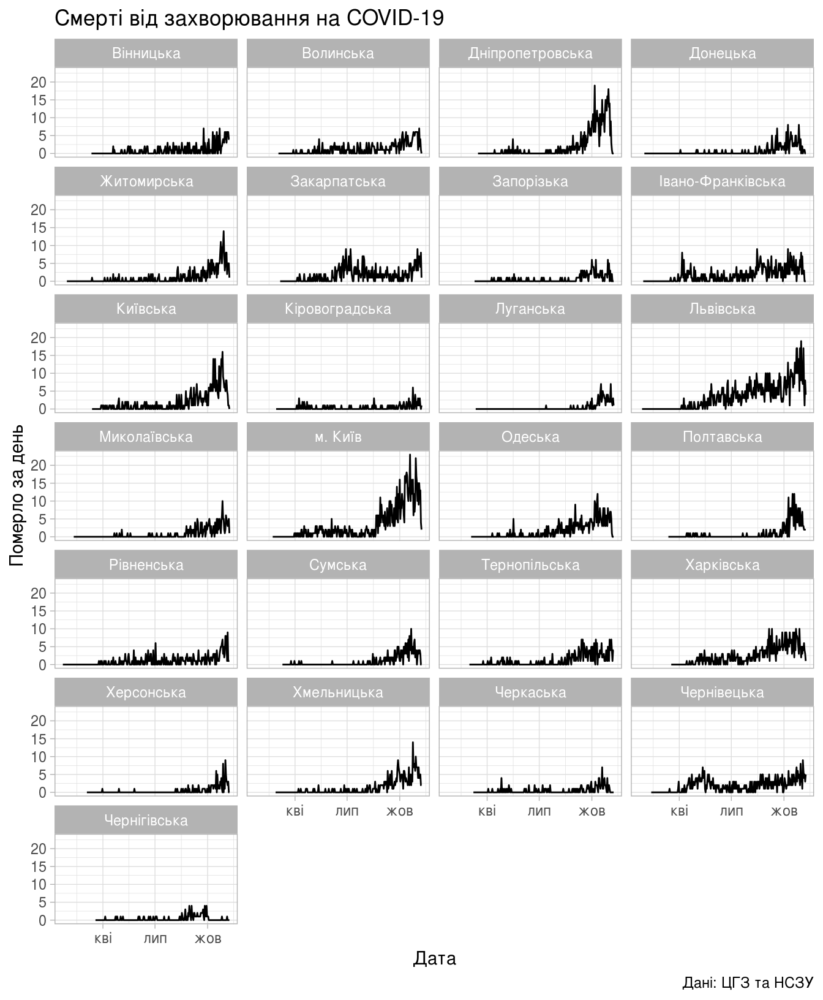
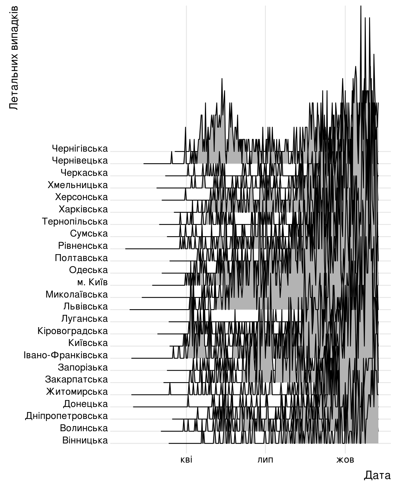
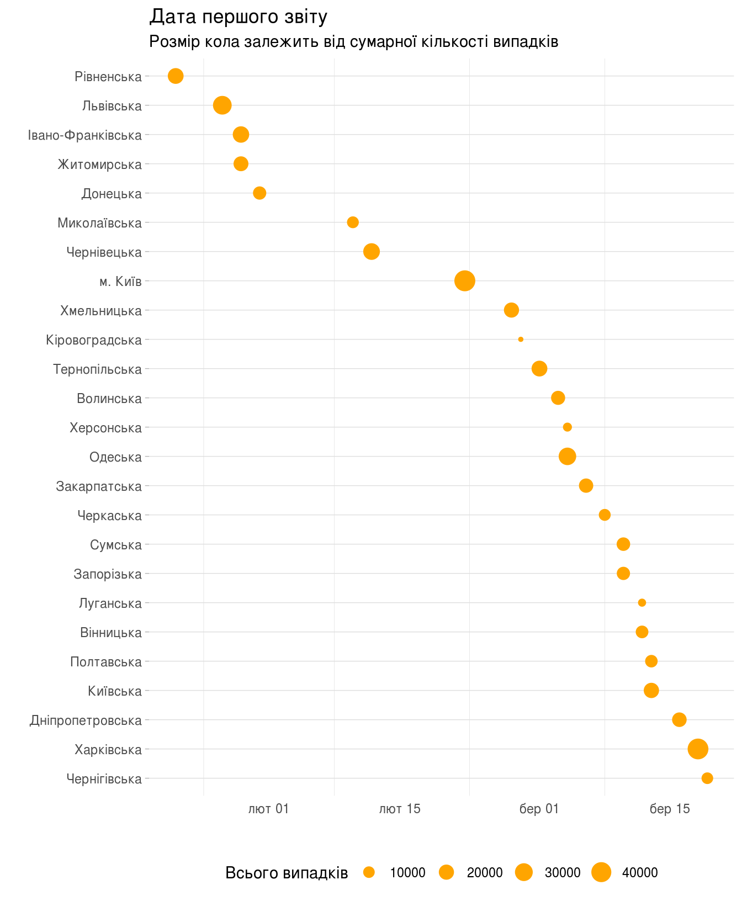

Динаміка поширення коронавірусної інфекції по областях
================

Нещодавно сайт "Тексти" поширив чудову статтю «[Україна проти COVID-19: ні поразки, ні перемоги. Ми у групі країн, які найгірше справляються з пандемією](https://texty.org.ua/fragments/100954/ukrayina-proty-covid-19-ni-porazky-ni-peremohy/ "Тексти: Україна проти COVID-19: ні поразки, ні перемоги. Ми у групі країн, які найгірше справляються з пандемією")» з цікавим графіком, на якому було зображено динаміку поширення коронавірусної хвороби в різних країнах. Добова кількість виявлених випадків була нормалізована для кожної країни, а тому графік дає можливість подивитись саме на динаміку, а не на масштаб епідемії у кожній окремій країні.

Нижче буде побудовано чимось схожий графік динаміки поширення коронавірусної інфекції COVID-19 в Україні, в розрізі областей, але без нормалізації. Аналі зроблений в системі R ([прочитати більше у Вікі](https://uk.wikipedia.org/w/index.php?title=R_(%D0%BC%D0%BE%D0%B2%D0%B0_%D0%BF%D1%80%D0%BE%D0%B3%D1%80%D0%B0%D0%BC%D1%83%D0%B2%D0%B0%D0%BD%D0%BD%D1%8F)&oldid=28060661)).

Також у Вікі можна дізнатись більше про [перебіг епідемії в Україні](https://uk.wikipedia.org/wiki/%D0%9A%D0%BE%D1%80%D0%BE%D0%BD%D0%B0%D0%B2%D1%96%D1%80%D1%83%D1%81%D0%BD%D0%B0_%D1%85%D0%B2%D0%BE%D1%80%D0%BE%D0%B1%D0%B0_2019_%D0%B2_%D0%A3%D0%BA%D1%80%D0%B0%D1%97%D0%BD%D1%96).

Всі вихідні дані можна знайти в [репозиторії covid19\_ua](https://github.com/VasiaPiven/covid19_ua).

Підготовка даних
----------------

Побудуємо графіки поширення коронавірусної інфекції COVID-19 (спричиненої вірусом SARS-CoV-2) по областях. Для цього скористаємось бібліотеками функцій з колекції [`tidyverse`](https://tidyverse.org), зокрема `ggplot2` для створення графіків, `readr` для зчитування, та `dplyr` для підготовки.

``` r
library(tidyverse)
library(ggridges)
```

Якщо системні налаштування локалі не співпадають з бажаними, їх можна змінити навіть тоді, коли сеанс роботи в R розпочато, для цього знадобиться функція [`Sys.setlocale`](https://www.rdocumentation.org/packages/base/versions/3.6.2/topics/locales):

``` r
Sys.setlocale(category="LC_ALL",locale="uk_UA.utf8" )
```

Тепер вже можна починати роботу. Зчитаємо із використанням функції [`read_csv`](https://readr.tidyverse.org/reference/read_delim.html) бібліотеки `tidyverse` а не стандартної `read.csv`. Таким чином отримаємо дані одразу в структурі даних, зручній для подальшої роботи.

``` r
area_dyn <- read_csv('../covid19_by_area_type_hosp_dynamics.csv')
```

    ## Parsed with column specification:
    ## cols(
    ##   zvit_date = col_date(format = ""),
    ##   registration_area = col_character(),
    ##   priority_hosp_area = col_character(),
    ##   edrpou_hosp = col_character(),
    ##   legal_entity_name_hosp = col_character(),
    ##   legal_entity_lat = col_double(),
    ##   legal_entity_lng = col_double(),
    ##   person_gender = col_character(),
    ##   person_age_group = col_character(),
    ##   add_conditions = col_character(),
    ##   is_medical_worker = col_character(),
    ##   new_susp = col_double(),
    ##   new_confirm = col_double(),
    ##   active_confirm = col_double(),
    ##   new_death = col_double(),
    ##   new_recover = col_double()
    ## )

    ## Warning: 82 parsing failures.
    ##  row              col               expected  actual                                        file
    ## 1381 legal_entity_lat no trailing characters ,604941 '../covid19_by_area_type_hosp_dynamics.csv'
    ## 1381 legal_entity_lng no trailing characters ,271351 '../covid19_by_area_type_hosp_dynamics.csv'
    ## 3272 legal_entity_lat no trailing characters ,604941 '../covid19_by_area_type_hosp_dynamics.csv'
    ## 3272 legal_entity_lng no trailing characters ,271351 '../covid19_by_area_type_hosp_dynamics.csv'
    ## 5227 legal_entity_lat no trailing characters ,604941 '../covid19_by_area_type_hosp_dynamics.csv'
    ## .... ................ ...................... ....... ...........................................
    ## See problems(...) for more details.

Функція `read_csv`, окрім власне зчитування самої таблиці, іще й намагається правильно визначити типи даних, що зберігаються в кожному зі ствопчиків. І хоча розробники радять вказувати типи даних для кожного стовпчика явним чином, в нашому випадку це може бути зайвим, адже функція вірно визначає всі типи даних, навіть [`Date`](https://www.rdocumentation.org/packages/base/versions/3.6.2/topics/Dates) для стовпчика `zvit_date`.

``` r
head(area_dyn)
```

    ## # A tibble: 6 x 16
    ##   zvit_date  registration_ar… priority_hosp_a… edrpou_hosp legal_entity_na…
    ##   <date>     <chr>            <chr>            <chr>       <chr>           
    ## 1 2020-05-24 Вінницька        Вінницька        01982502    КНП ВІННИЦЬКА Ц…
    ## 2 2020-05-24 Вінницька        Вінницька        01982502    КНП ВІННИЦЬКА Ц…
    ## 3 2020-05-24 Вінницька        Вінницька        01982502    КНП ВІННИЦЬКА Ц…
    ## 4 2020-05-24 Вінницька        Вінницька        01982502    КНП ВІННИЦЬКА Ц…
    ## 5 2020-05-24 Вінницька        Вінницька        01982502    КНП ВІННИЦЬКА Ц…
    ## 6 2020-05-24 Вінницька        Вінницька        01982502    КНП ВІННИЦЬКА Ц…
    ## # … with 11 more variables: legal_entity_lat <dbl>, legal_entity_lng <dbl>,
    ## #   person_gender <chr>, person_age_group <chr>, add_conditions <chr>,
    ## #   is_medical_worker <chr>, new_susp <dbl>, new_confirm <dbl>,
    ## #   active_confirm <dbl>, new_death <dbl>, new_recover <dbl>

Таблиця в файлі `covid19_by_area_type_hosp_dynamics.csv` має доволі велику кількість стовпчиків, перелічемо їх для зручності подальшого використання в скрипті:

zvit\_date, registration\_area, priority\_hosp\_area, edrpou\_hosp, legal\_entity\_name\_hosp, legal\_entity\_lat, legal\_entity\_lng, person\_gender, person\_age\_group, add\_conditions, is\_medical\_worker, new\_susp, new\_confirm, active\_confirm, new\_death, new\_recover.

Зараз нам цікаві лише кілька:

-   `zvit_date`, дата
-   `registration_area`, назва області або місто Київ
-   `new_susp`, кількість підозр зареєстрованих протягом цього дня
-   `new_confirm`, кількість підтверджених випадків захворювання протягом дня
-   `new_death`, кількість зареєстрованих смертей протягом дня

Наступним кроком підрахуємо сумарні значення цікавих нам показників, що припадають на певний регіон протягом доби. Бібліотека `tidyverse` дає можливість зробити це функціями, що ззовні нагадують відповідні конструкції в SQL:

``` r
daily_area_reg_dyn <- area_dyn %>%
    select(zvit_date, priority_hosp_area, new_susp, new_confirm, new_death) %>%
    mutate(registration_area=factor(case_when(
               priority_hosp_area == "м. Київ" ~ "м. Київ",
               TRUE ~ stringr::str_to_title(priority_hosp_area)))) %>%
    group_by(zvit_date, registration_area) %>%
    summarise(new_susp = sum(new_susp),
              new_confirm = sum(new_confirm),
              new_death = sum(new_death))
```

Нарешті, все готово для створення графіка.

Підозри на захворювання COVID-19
--------------------------------

Слід зазначити, що інформація в розрізі днів агрегована безпосередньо за датою реєстрації підозр, даті тестування/одужання/смерті та не залежить від дати, коли ці дані було оприлюднено.

Далі буде три однотипних графіка, тому детально розгляньмо будову лише першого: динаміка нових підозр на захворювання на COVID-19.

Оскільки графік має єдине джерело даних та однакові параметри вісей, це можна вказати одразу в [конструкторі об'єкта ggplot](https://ggplot2.tidyverse.org/reference/ggplot.html):

``` r
plot_susp <- ggplot(daily_area_reg_dyn, aes(x=zvit_date, y=new_susp))
```

Далі до графіка слід додати визначення графічних об'єктів, що будуть на ньому зображено:

``` r
plot_susp <- plot_susp + geom_line()
```

Оскільки ми прагнемо створити окремий графік для кожної окремої області та міста Києва (стовпчик `registration_area`), слід додати відповідну інструкцію до графіка: `facet_wrap` робить саме це, тут слід вказати стовпчик, в якому знаходиться критерій для поділу, та кількість рядків або стовпчиків, у яких буде розташовано графіки.

``` r
plot_susp <- plot_susp + facet_wrap(vars(registration_area), ncol = 4)
```

GGplot2 має зручний механізм налаштування декорацій, який дає можливість як детальних підлаштувань під конкретні потреби, так і набори вже наперед заданих параметрів, так званих "тем". Оберемо "легку" тему:

``` r
plot_susp <- plot_susp + theme_light()
```

Ну і нарешті визначимо такі атрибути графіка, як його назву, підпис, назви вісей, тощо:

``` r
plot_susp <- plot_susp + labs(title="Підозри на захворювання COVID-19",
           x = "Дата",
           y = "Підозр на день",
           caption = "Дані: ЦГЗ та НСЗУ")

plot_susp
```



Результат.

Підтверджені випадки захворювання на COVID-19
---------------------------------------------

Динаміка лабораторно підтверджених випадків захворювань на COVID-19.

``` r
(ggplot(daily_area_reg_dyn, aes(x=zvit_date, y=new_confirm))
    + geom_line()
    + facet_wrap(vars(registration_area), ncol = 4)
    + theme_light()
    + labs(title="Підтверджені випадки захворювання на COVID-19",
           x = "Дата",
           y = "Випадків на день",
           caption = "Дані: ЦГЗ та НСЗУ"))
```



Смерті від захворювання на COVID-19
-----------------------------------

Динаміка летальних випадків у пацієнтів, хворих на COVID-19.

``` r
(ggplot(daily_area_reg_dyn, aes(x=zvit_date, y=new_death))
    + geom_line()
    + facet_wrap(vars(registration_area), ncol = 4)
    + theme_light()
    + labs(title="Смерті від захворювання на COVID-19",
           x = "Дата",
           y = "Померло за день",
           caption = "Дані: ЦГЗ та НСЗУ"))
```



Інші варіанти
-------------

Всі області одразу (тут іще треба поліпшувати) із використанням бібліотеки [`ggridges`](https://cran.r-project.org/web/packages/ggridges/index.html) (кількість летальних випадків):

``` r
(ggplot(daily_area_reg_dyn,
        aes(x=zvit_date, y=registration_area,
            height=new_death,
            group=registration_area))
        + geom_ridgeline()
        + theme_ridges()
        + xlab("Дата")
        + ylab("Летальних випадків"))
```



Коли був зареєстрований перший випадок в кожній області.

``` r
area_first <- area_dyn %>%
    select(zvit_date, registration_area, new_confirm) %>%
    mutate(registration_area=factor(case_when(
               registration_area == "м. Київ" ~ "м. Київ",
               TRUE ~ stringr::str_to_title(registration_area)))) %>%
    group_by(registration_area) %>%
    summarise(zvit_date=min(zvit_date),
              new_confirm=sum(new_confirm))

latest <- max(area_first$zvit_date)
```

Крапками позначимо перший лабораторно підтверджений випадок захворювання, але скористаємось функцією `fct_reorder` для розташування областей в хронологічній послідовності:

``` r
(ggplot(area_first,
        aes(fct_reorder(registration_area,desc(zvit_date)),
            zvit_date,
            size=new_confirm))
    + geom_point(color="orange")
    + scale_size_continuous(name = "Всього випадків")
    + coord_flip()
    + theme_light()
    + theme(
          panel.grid.major.x = element_blank(),
          panel.border = element_blank(),
          axis.ticks.x = element_blank(),
          legend.position = "bottom")
    + labs(title="Дата першого звіту",
           subtitle="Розмір кола залежить від сумарної кількості випадків",
           x="",
           y=""))
```



[Повернутись на головну](index.html) або [повідомити про помилку]((https://github.com/vityok/covid19_ua/issues))
